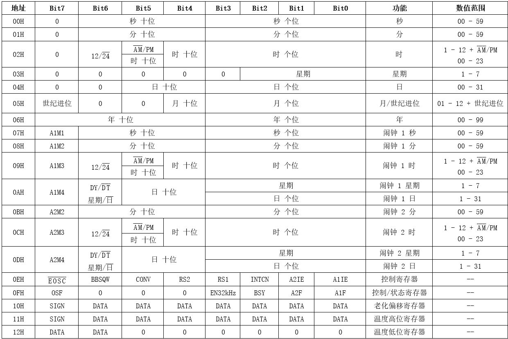
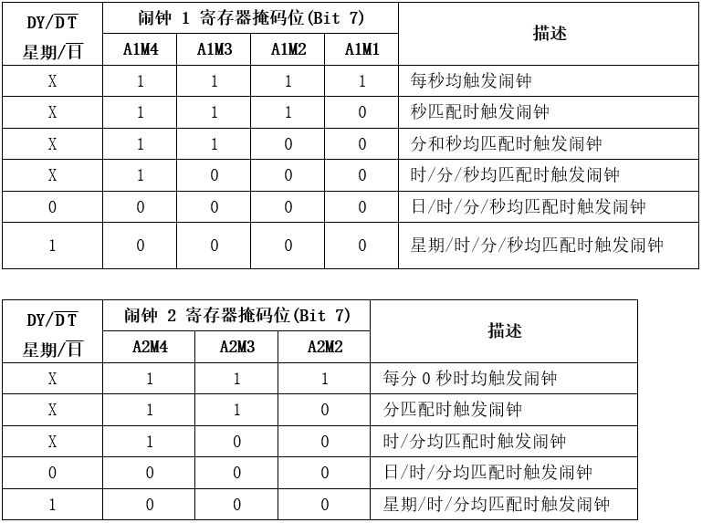

## ESP8266 学习笔记 10 —— IIC 与 DS3231 RTC实例
作者：Preston_zhu<br>
日期：2020.6.30

### 1. 实例分析

参考 RTOS_SDK/examples/peripherals/i2c
是基于 IIC 控制 DS3231 RTC 模块

#### i. DS3231 重点内容分析

参考手册：doc\peripherals\DS3231.pdf

##### 1) 主要性能参数
> * 支持备用电池输入，以保持持续计时
> * 实时时钟计算：秒，分，时，星期，日，月，年。其中闫年补偿有效期至 2100 年
> * 支持月份天数自动计算，支持 24/12（带 AM/PM） 两种小时制
> * 支持 2 个闹钟
> * 支持可编程方波输出
> * 精度：+/-2 min 每年

##### 2) 主要功能引脚说明
| Pin | 名称 | 功能 |
| ---- | ---- | ---- |
| 1 | 32kHz | 输出 32kHz 方波。开漏输出，需要外部上拉电阻。未使用可悬空 |
| 2 | VCC | 电源+ |
| 3 | <span style="text-decoration:overline">INT</span>/SQW | 低电平中断输出或方波输出。开漏输出，需要外部上拉电阻。未使用可悬空。<br>其功能为控制寄存器 INTCN 位控制。<br>INTCN = 0，输出方波，方波频率则由 RS2 和 RS1 位控制。<br>INTCN = 1，当定时闹钟到期后，输出低电平（需要使能 A2IE 或 A1IE）。<br>上电后，INTCN 默认为 1，所以此引脚默认为中断输出，但闹钟禁止 |
| 4 | <span style="text-decoration:overline">RST</span> | 低电平输出复位 |
| 5 - 12 | N.C. | 必需连接至 GND |
| 13 | GND | 电源地 |
| 14 | VBAT | 备用电源输入。备用电源需要增加 0.1uF ~ 1.0uF 的低漏去耦电容。如果仅使用备用电源给 DS3231 供电，则此电容可省略。如果不使用备用电源，则此引脚接地 |
| 15 | SDA | IIC 串行数据输入输出引脚。开漏输出，需要外部上拉电阻 |
| 16 | SCL | IIC 串行时钟引脚。开漏输出，需要外部上拉电阻 |

##### 3) 从设备地址

* 1101000 （7 bits）

##### 4) 寄存器


##### <font color="red">5) 寄存器注解</font>

**这是 DS3231 应用的核心内容**

* 日期时间寄存器 00h - 06h

根据相关设置，读取出对应的时间，年月日时分秒

同样可以根据当前日期时间，设置 DS3231 日期时间寄存器

注意：日期时间对应格式，类似于 BCD 码，需要根据不同的位置设置数值

* 闹钟寄存器

支持两个闹钟，闹钟 1 可设置日/星期，时，分，秒。闹钟 2 可设置日/星期，时，分

闹钟小时，可以区分 24 或 12 小时制，12 小时制可以区分 AM/PM

闹钟日/星期，可以按每周星期几，或每月哪一天触发

触发匹配方式，由 寄存器 A1M1 - A1M4 和 DY/<span style="text-decoration:overline">DT</span> 位控制，如下表：


* 控制寄存器 0Eh

| Bit7 | Bit6 | Bit5 | Bit4 | Bit3 | Bit2 | Bit1 | Bit0 |
| :--: | :--: | :--: | :--: | :--: | :--: | :--: | :--: |
| <span style="text-decoration: overline">EOSC</span> | BBSQW | CONV | RS2 | RS1 | INTCN | A2IE | A1IE |

Bit 7: 使能晶振 Enable Oscillator (<span style="text-decoration:overline">EOSC</span>) - **上电初始为 0**。0 : 晶振开启；1 : 当 DS3231 切换到备用电源 VBAT 时，晶振禁止。当 DS3231 通过 VCC 供电时，晶振始终开启，而不受 <span style="text-decoration:overline">EOSC</span> 位控制

Bit 6: 备用电池方波使能 Battery-Backed Square-Wave Enable (BBSQW) - **上电初始为 0**。0 : 当 VCC 低于电源故障触发点时，<span style="text-decoration:overline">INT</span>/SQW 引脚则为高阻态；1 : 当 DS3231 仅由备用电池供电且 VCC 未接入时，启用方波输出

Bit 5: 转换温度 Convert Temperature (CONV)

Bits 3/4： 速率选择 Rate Select (RS2/RS1) - **上电初始均为1，即输出频率为 8.192kHz**。当方波输出使能时，根据下表选择对应输出频率
| RS2 | RS1 | 方波输出频率 |
| :--: | :--: | :--: |
| 0 | 0 | 1Hz |
| 0 | 1 | 1.024kHz |
| 1 | 0 | 4.096kHz |
| 1 | 1 | 8.192kHz |

Bit 2: 中断控制 Interrupt Control (INTCN) - **上电初始为 1**，控制 <span style="text-decoration:overline">INT</span>/SQW 引脚输出信号。0 : <span style="text-decoration:overline">INT</span>/SQW 引脚输出方波；1 : 当 A2IE 或 A1IE 使能时，<span style="text-decoration:overline">INT</span>/SQW 引脚响应闹钟 1 或 2 中断。不管 INTCN 位为什么状态，A2F 和 A1F 均会响应。**<span style="text-decoration:overline">INT</span>/SQW 正常为高电平，中断产生时为低电平。清除状态寄存器 A2F 或 A1F，则恢复高电平（需要中断全局控制）**

Bit 1: 闹钟 2 中断使能 Alarm 2 Interruption Enable (A2IE)  - **上电初始为 0**。0 : 禁止闹钟 2 中断；1 : 使能闹钟 2 中断

Bit 0: 闹钟 1 中断使能 Alarm 1 Interruption Enable (A1IE)  - **上电初始为 0**。0 : 禁止闹钟 1 中断；1 : 使能闹钟 1 中断

* 控制/状态寄存器 0Fh

| Bit7 | Bit6 | Bit5 | Bit4 | Bit3 | Bit2 | Bit1 | Bit0 |
| :--: | :--: | :--: | :--: | :--: | :--: | :--: | :--: |
| OSF | 0 | 0 | 0 | EN32kHz | BSY | A2F | A1F |

Bit 7: 晶振停止状态位 Oscillator Stop Flag (OSF) 

Bit 3: 使能 32kHz 方波输出 Enable 32kHz Output (EN32kHz) - **上电初始为1**，表示 32kHz 引脚状态。0 : 32kHz 引脚输出高阻态；1 : 32kHz 引脚输出 32.768kHz 方波

Bit 2: 忙碌状态 Busy (BSY) - 当 DS3231 正在执行 TCXO 功能时，处理忙碌状态。当温度传感器转换信号被断言时，此位为 1；当 DS3231 进入 1 分钟的空闲状态 (idle state) 时则清零

Bit 1: 闹钟 2 中断标志位 Alarm 2 Flag (A2F) - 0 : 清除闹钟 2 触发状态，清除此位后 <span style="text-decoration:overline">INT</span>/SQW 引脚恢复高电平；1 : 闹钟 2 触发，置位此状态位，如果 INTCN 与 A2IE 均为 1，则 <span style="text-decoration:overline">INT</span>/SQW 引脚拉低；**此位仅能写入 0**

Bit 0: 闹钟 1 中断标志位 Alarm 1 Flag (A1F) - 0 : 清除闹钟 1 触发状态，清除此位后 <span style="text-decoration:overline">INT</span>/SQW 引脚恢复高电平；1 : 闹钟 1 触发，置位此状态位，如果 INTCN 与 A1IE 均为 1，则 <span style="text-decoration:overline">INT</span>/SQW 引脚拉低；**此位仅能写入 0**

* 温度寄存器 11h/12h

高字节 11h
| Bit7 | Bit6 | Bit5 | Bit4 | Bit3 | Bit2 | Bit1 | Bit0 |
| :--: | :--: | :--: | :--: | :--: | :--: | :--: | :--: |
| Sign | D8 | D7 | D6 | D5 | D4 | D3 | D2|

低字节 12h
| Bit7 | Bit6 | Bit5 | Bit4 | Bit3 | Bit2 | Bit1 | Bit0 |
| :--: | :--: | :--: | :--: | :--: | :--: | :--: | :--: |
| D1 | D0 | 0 | 0 | 0 | 0 | 0 | 0 |

温度用 10 位数表示，分辨率为 +0.25°C，可在位置 11h 和 12h 访问。温度以 2 的补码格式编码。高 8 位在位置 11h，低 2 位在位置 12h 的高位半字节中。电源复位后，寄存器设置为 0°C 的默认温度，控制器开始温度转换。新的温度读数存储在该寄存器中

温度转换编码实例：
| 温度 | 输出编码 |
| :--: | :--: |
| -128°C  | 10 0000 0000 |
| -125°C  | 10 0000 1100 |
| -100°C  | 10 0111 0000 |
| -75°C   | 10 1101 0100 |
| -50°C   | 10 0011 1000 |
| -25°C   | 11 1001 1100 |
| -0.25°C | 11 1111 1111 |
| 0°C     | 00 0000 0000 |
| +0.25°C | 00 0000 0001 |
| +10°C   | 00 0010 1000 |
| +25°C   | 00 0110 0100 |
| +50°C   | 00 1100 1000 |
| +75°C   | 01 0010 1100 |
| +100°C  | 01 1001 0000 |
| +125°C  | 01 1111 0100 |
| +127°C  | 01 1111 1100 |

#### ii. 主程序分析

```C
/**
 * 说明:
 * 本实例展示如何使用 IIC
 * 使用 IIC 控制 DS3231 RTC 模块
 *
 * GPIO 配置状态:
 * GPIO14 作为主机 SDA 连接至 DS3231 SDA
 * GPIO2  作为主机 SCL 连接到 DS3231 SCL
 * 不必要增加外部上拉电阻，驱动程序将使能内部上拉电阻
 *
 * 测试:
 * 如果连接上 DS3231，则读取数据
 */
#include <stdio.h>
#include <string.h>
#include <stdlib.h>

#include "freertos/FreeRTOS.h"
#include "freertos/task.h"
#include "freertos/queue.h"

#include "esp_log.h"
#include "esp_system.h"
#include "esp_err.h"

#include "driver/i2c.h"
#include "driver/gpio.h"


static const char *TAG = "DS3231";

#define I2C_PORT_2_DS3231			I2C_NUM_0        /*!< 主机设备 IIC 端口号 */

#define DS3231_ADDR					0x68             /*!< 从机 DS3231 地址 */
#define WRITE_BIT                   I2C_MASTER_WRITE /*!< I2C 主机写操作位 */
#define READ_BIT                    I2C_MASTER_READ  /*!< I2C 主机读操作位 */
#define ACK_CHECK_EN                0x1              /*!< I2C 主机确认接收从机 ACK 信号 */
#define ACK_CHECK_DIS               0x0              /*!< I2C 主机不接收从机 ACK 信号  */
#define ACK_VAL                     0x0              /*!< I2C ACK值 */
#define NACK_VAL                    0x1              /*!< I2C NACK值 */
#define LAST_NACK_VAL               0x2              /*!< I2C 末尾ACK值 */

/**
 * DS3231 寄存器地址
 */
#define REG_SEC					0x00
#define REG_MIN					0x01
#define REG_HOUR				0x02
#define REG_DAY					0x03
#define REG_DATE				0x04
#define REG_MONTH				0x05
#define REG_YEAR				0x06
#define REG_A1_SEC				0x07
#define REG_A1_MIN				0x08
#define REG_A1_HOUR				0x09
#define REG_A1_DATE				0x0A
#define REG_A2_MIN				0x0B
#define REG_A2_HOUR				0x0C
#define REG_A2_DATE				0x0D
#define REG_CTRL				0x0E
#define REG_CTRL_STATUS			0x0F
#define REG_AGING_OFFSET		0x10
#define REG_TEMP_MSB			0x11
#define REG_TEMP_LSB			0x12

/* IIC 主机初始化：主机模式，GPIO */
static esp_err_t i2c_module_init(void)
{
	i2c_config_t conf;

	// 主机模式
	conf.mode = I2C_MODE_MASTER;
	// GPIO14 -> SDA
	conf.sda_io_num = GPIO_NUM_14;
	// SDA 引脚上拉
	conf.sda_pullup_en = 0;
	// GPIO2 -> SCL
	conf.scl_io_num = GPIO_NUM_2;
	// SCL 引脚上拉
	conf.scl_pullup_en = 0;

	// 设置 IIC 工作模式
	ESP_ERROR_CHECK(i2c_driver_install(I2C_PORT_2_DS3231, conf.mode));
	// 设置 IIC 引脚配置
	ESP_ERROR_CHECK(i2c_param_config(I2C_PORT_2_DS3231, &conf));

	return ESP_OK;
}

/* IIC 主机发送数据 */
static esp_err_t ds3231_write(i2c_port_t i2c_num, uint8_t reg_address,
							   uint8_t *data, size_t data_len)
{
	int ret = 0;
	// 创建 IIC 命令连接
	i2c_cmd_handle_t cmd = i2c_cmd_link_create();

	// 创建一个命令队列，并装载一个开始信号
	i2c_master_start(cmd);
	// 装载一个从机地址及写指令，ACK 应答使能
	i2c_master_write_byte(cmd, DS3231_ADDR << 1 | WRITE_BIT, ACK_CHECK_EN);
	// 装载从机寄存器地址，ACK应答使能
	i2c_master_write_byte(cmd, reg_address, ACK_CHECK_EN);
	// 装载写至从机寄存器的数据，ACK应答使能
	i2c_master_write(cmd, data, data_len, ACK_CHECK_EN);
	// 装载停止信号
	i2c_master_stop(cmd);

	// 发送命令队列中的数据
	ret = i2c_master_cmd_begin(i2c_num, cmd, 1000 / portTICK_RATE_MS);
	// 释放命令连接
	i2c_cmd_link_delete(cmd);

	return ret;
}

/**
 * 1. IIC 主机发送待读取寄存器地址到从设备
 * 2. IIC 主机读取从机返回的数据
 */
static esp_err_t ds3231_read(i2c_port_t i2c_num, uint8_t reg_address,
							  uint8_t *data, size_t data_len)
{
	int ret;
	// 创建 IIC 命令连接
	i2c_cmd_handle_t cmd = i2c_cmd_link_create();

	// 给从机发送读数据地址，通知其准备数据
	// 创建一个命令队列，并装载一个开始信号
	i2c_master_start(cmd);
	// 装载一个从机地址及写指令，ACK 应答使能
	i2c_master_write_byte(cmd, DS3231_ADDR << 1 | WRITE_BIT, ACK_CHECK_EN);
	// 装载从机寄存器地址，即待读取数据的寄存器地址，ACK应答使能
	i2c_master_write_byte(cmd, reg_address, ACK_CHECK_EN);
	// 装载停止信号
	i2c_master_stop(cmd);
	// 发送命令队列中的数据
	ret = i2c_master_cmd_begin(i2c_num, cmd, 1000 / portTICK_RATE_MS);
	// 释放命令连接
	i2c_cmd_link_delete(cmd);

	// 验证读取命令是否发送成功
	if(ret != ESP_OK)
	{
		return ret;
	}

	// 主机读取从机发送的数据
	cmd = i2c_cmd_link_create();
	// 创建一个命令队列，并装载一个开始信号
	i2c_master_start(cmd);
	// 装载一个从机地址及读指令，ACK 应答使能
	i2c_master_write_byte(cmd, DS3231_ADDR << 1 | READ_BIT, ACK_CHECK_EN);
	// 装载读取命令，待读取数据缓存区和数据长度，用于从 IIC 总线读取数据，
	// 最后一个数据应答 NACK
	i2c_master_read(cmd, data, data_len, LAST_NACK_VAL);
	// 装载停止信号
	i2c_master_stop(cmd);
	// 发送命令队列中的数据
	// ** 这里不好理解 **
	// 命令队列中装载了读取的信息：缓存区和数据长度，
	// 这里才会真正处理读取数据操作。是阻塞运行。并将读取的数据存储至缓存区
	// 所以程序返回时，数据应该已经读取到缓存区了，可以再取出来用了
	// 多个数据的读取，被封装在底层驱动中了
	ret = i2c_master_cmd_begin(i2c_num, cmd, 1000 / portTICK_RATE_MS);
	// 释放命令连接
	i2c_cmd_link_delete(cmd);

	return ret;
}

static void ds3231_set_datetime(uint8_t year, uint8_t mon, uint8_t day,
								uint8_t weekday,
								uint8_t hour, uint8_t min, uint8_t sec)
{
	uint8_t datetime[7];

	datetime[0] = ((sec / 10) << 4) | (sec % 10);
	datetime[1] = ((min / 10) << 4) | (min % 10);
	datetime[2] = ((hour / 10) << 4) | (hour % 10);
	datetime[3] = ((weekday / 10) << 4) | (weekday % 10);
	datetime[4] = ((day / 10) << 4) | (day % 10);
	datetime[5] = ((mon / 10) << 4) | (mon % 10);
	datetime[6] = ((year / 10) << 4) | (year % 10);

	// 设置 DS3231 RTC 时间
	ESP_ERROR_CHECK(ds3231_write(I2C_PORT_2_DS3231, REG_SEC, datetime, 7));
}

/* is_by_weekday: 0 - 每月这天; 1 - 每周这天 */
/* 闹钟触发条件：日/星期，时，分，均匹配时触发 */
static void ds3231_set_alarm1(uint8_t day, uint8_t hour, uint8_t min, uint8_t sec, uint8_t is_by_weekday)
{
	uint8_t datetime[4];

	datetime[0] = ((sec / 10) << 4) | (sec % 10);
	datetime[1] = ((min / 10) << 4) | (min % 10);
	datetime[2] = ((hour / 10) << 4) | (hour % 10);
	datetime[3] = ((day / 10) << 4) | (day % 10);

	if(1 == is_by_weekday)
	{
		datetime[3] |= 0x40;
	}

	// 设置 DS3231 RTC 时间
	ESP_ERROR_CHECK(ds3231_write(I2C_PORT_2_DS3231, REG_A1_SEC, datetime, 4));
}

/* is_by_weekday: 0 - 每月这天; 1 - 每周这天 */
/* 闹钟触发条件：日/星期，时，分，均匹配时触发 */
static void ds3231_set_alarm2(uint8_t day, uint8_t hour, uint8_t min, uint8_t is_by_weekday)
{
	uint8_t datetime[3];

	datetime[0] = ((min / 10) << 4) | (min % 10);
	datetime[1] = ((hour / 10) << 4) | (hour % 10);
	datetime[2] = ((day / 10) << 4) | (day % 10);

	if(1 == is_by_weekday)
	{
		datetime[2] |= 0x40;
	}

	// 设置 DS3231 RTC 时间
	ESP_ERROR_CHECK(ds3231_write(I2C_PORT_2_DS3231, REG_A2_MIN, datetime, 3));
}

/* 初始化 DS3231 */
static esp_err_t ds3231_init(i2c_port_t i2c_num)
{
	uint8_t cmd_data = 0;

	vTaskDelay(100 / portTICK_RATE_MS);

	i2c_module_init();	// 初始化 IIC 接口

	// 开机时设置当前日期时间
	// ds3231_set_datetime(20, 6, 30, 2, 15, 21, 0);

	// 配置 DS3231，RS: 8kHz, 中断使能，闹钟 1 和 2 中断使能
	cmd_data = 0x1F;
	ESP_ERROR_CHECK(ds3231_write(I2C_PORT_2_DS3231, REG_CTRL, &cmd_data, 1));
	// 配置 DS3231，清除 Alarm 1 和 Alarm 2 中断标志位
	cmd_data = 0x88;
	ESP_ERROR_CHECK(ds3231_write(I2C_PORT_2_DS3231, REG_CTRL_STATUS, &cmd_data, 1));

	// 设置闹钟
	ds3231_set_alarm1(2, 15, 48, 05, 1);
	// ds3231_set_alarm2(4, 22, 54, 1);

	return ESP_OK;
}

static void i2c_task_example(void *arg)
{
	uint8_t datetime_data[19];
	static uint32_t error_count = 0;
	int temp = 0;
	int temp_flag = ' ';
	float temp_val = 0;
	int ret = 0;
	int need_clean_alarm_flag = 0;

	// 初始化 DS3231
	ds3231_init(I2C_PORT_2_DS3231);

	for(;;)
	{
		memset(datetime_data, 0, 19);
		// 读取 DS3231 日期时间数据
		ret = ds3231_read(I2C_PORT_2_DS3231, REG_SEC, datetime_data, 19);
		if(ret == ESP_OK)
		{
			ESP_LOGI(TAG, "*******************");
			ESP_LOGI(TAG, "Datetime : 20%02X-%02X-%02X [%X] %02X:%02X:%02X",
					 datetime_data[6], datetime_data[5], datetime_data[4],
					 datetime_data[3],
					 datetime_data[2], datetime_data[1], datetime_data[0]);

			ESP_LOGI(TAG, "Alarm 1  : %s %02X %02X:%02X:%02X",
					 datetime_data[10] & 0x40 ? "Each Weekday:" : "Each Month Date:",
					 datetime_data[10] & 0xBF,
					 datetime_data[9], datetime_data[8], datetime_data[7]);

			ESP_LOGI(TAG, "Alarm 2  : %s %02X %02X:%02X",
					 datetime_data[13] & 0x40 ? "Each Weekday:" : "Each Month Date:",
					 datetime_data[13] & 0xBF,
					 datetime_data[12], datetime_data[11]);

			ESP_LOGI(TAG, "Control  : %02X", datetime_data[14]);
			ESP_LOGI(TAG, "Status   : %02X", datetime_data[15]);
			if(0 != (datetime_data[15] & 0x02))
			{
				ESP_LOGI(TAG, "         - Alarm 2 Trigger");
				datetime_data[15] &= 0xFD;
				need_clean_alarm_flag = 1;
			}
			if(0 != (datetime_data[15] & 0x01))
			{
				ESP_LOGI(TAG, "         - Alarm 1 Trigger");
				datetime_data[15] &= 0xFE;
				need_clean_alarm_flag = 1;
			}
			ESP_LOGI(TAG, "Aging    : %02X", datetime_data[16]);

			temp = (datetime_data[17] << 8) | datetime_data[18];
			if(0 != (temp & 0x8000))
			{
				temp_flag = '-';
				temp &= 0x7FFF;
				// 计算温度 2 的补码格式编码
				temp -= 0x40;
				temp ^= 0x7FC0;
			}
			temp >>= 6;
			temp_val = temp * 0.25;
			
			ESP_LOGI(TAG, "Temp     :%c%d.%02d", temp_flag, (int)temp_val, ((int)(temp_val * 100) % 100));

			ESP_LOGI(TAG, "error_count: %d\n", error_count);

			if(1 == need_clean_alarm_flag)
			{
				ESP_ERROR_CHECK(ds3231_write(I2C_PORT_2_DS3231, REG_CTRL_STATUS, &datetime_data[15], 1));
			}
		}
		else
		{
			ESP_LOGE(TAG, "No ack, sensor not connected...skip...\n");
		}

		vTaskDelay(1000 / portTICK_RATE_MS);
	}

	i2c_driver_delete(I2C_PORT_2_DS3231);
}

void app_main(void)
{
	xTaskCreate(i2c_task_example, "i2c_task_example", 2048, NULL, 10, NULL);
}
```

#### iii. 打印输出

```shell
I (359) reset_reason: RTC reset 1 wakeup 0 store 0, reason is 1
I (469) gpio: GPIO[14]| InputEn: 0| OutputEn: 1| OpenDrain: 1| Pullup: 0| Pulldown: 0| Intr:0
I (469) gpio: GPIO[2]| InputEn: 0| OutputEn: 1| OpenDrain: 1| Pullup: 0| Pulldown: 0| Intr:0
I (489) DS3231: *******************
I (489) DS3231: Datetime : 2020-06-30 [2] 15:48:02
I (499) DS3231: Alarm 1  : Each Weekday: 02 15:48:05
I (499) DS3231: Alarm 2  : Each Weekday: 04 22:54
I (509) DS3231: Control  : 1F
I (519) DS3231: Status   : 88
I (519) DS3231: Aging    : 00
I (529) DS3231: Temp     : 32.00
I (539) DS3231: error_count: 0

I (1539) DS3231: *******************
I (1539) DS3231: Datetime : 2020-06-30 [2] 15:48:03
I (1539) DS3231: Alarm 1  : Each Weekday: 02 15:48:05
I (1549) DS3231: Alarm 2  : Each Weekday: 04 22:54
I (1549) DS3231: Control  : 1F
I (1559) DS3231: Status   : 88
I (1569) DS3231: Aging    : 00
I (1569) DS3231: Temp     : 32.00
I (1579) DS3231: error_count: 0

I (2579) DS3231: *******************
I (2579) DS3231: Datetime : 2020-06-30 [2] 15:48:04
I (2579) DS3231: Alarm 1  : Each Weekday: 02 15:48:05
I (2589) DS3231: Alarm 2  : Each Weekday: 04 22:54
I (2589) DS3231: Control  : 1F
I (2599) DS3231: Status   : 88
I (2609) DS3231: Aging    : 00
I (2609) DS3231: Temp     : 32.00
I (2619) DS3231: error_count: 0

I (3619) DS3231: *******************
I (3619) DS3231: Datetime : 2020-06-30 [2] 15:48:05
I (3619) DS3231: Alarm 1  : Each Weekday: 02 15:48:05
I (3629) DS3231: Alarm 2  : Each Weekday: 04 22:54
I (3629) DS3231: Control  : 1F
I (3639) DS3231: Status   : 89
I (3649) DS3231:          - Alarm 1 Trigger			# 日/星期，时，分，秒均匹配时，才触发闹钟
I (3649) DS3231: Aging    : 00
I (3659) DS3231: Temp     : 32.00
I (3669) DS3231: error_count: 0

I (4669) DS3231: *******************
I (4669) DS3231: Datetime : 2020-06-30 [2] 15:48:06
I (4669) DS3231: Alarm 1  : Each Weekday: 02 15:48:05
I (4679) DS3231: Alarm 2  : Each Weekday: 04 22:54
I (4689) DS3231: Control  : 1F
I (4689) DS3231: Status   : 88
I (4699) DS3231: Aging    : 00
I (4699) DS3231: Temp     : 32.00
I (4709) DS3231: error_count: 0

I (5709) DS3231: *******************
I (5709) DS3231: Datetime : 2020-06-30 [2] 15:48:07
I (5709) DS3231: Alarm 1  : Each Weekday: 02 15:48:05
I (5719) DS3231: Alarm 2  : Each Weekday: 04 22:54
I (5719) DS3231: Control  : 1F
I (5729) DS3231: Status   : 88
I (5739) DS3231: Aging    : 00
I (5739) DS3231: Temp     : 32.00
I (5749) DS3231: error_count: 0
```

#### iv. 遇到的问题记录
1.
<span style="text-decoration:overline">INT</span>/SQW 引脚的输出控制，不是特别好理解。但是多调试一下，就可以理解了。它与 INTCN、A2IE、A1IE、A2F、A1F 都有关联

2.
关于闹钟或时间，具体的细节如：12/24小时制，星期/日等情况，没有深入去调试与验证了

3.
温度部分，温度值的换算不是很好理解。后来找了 AD7416 温度传感器的 datasheet 文件作对比，终于理解了换算规则
