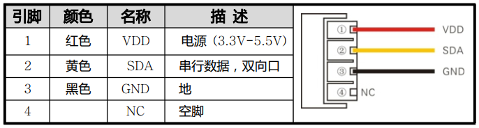
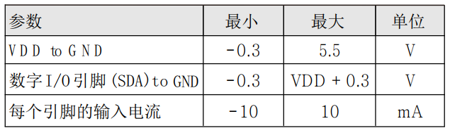

## ESP8266 学习笔记 10 —— IIC 与 DS3231 RTC实例
作者：Preston_zhu<br>
日期：2020.6.25

### 1. 实例分析

参考 RTOS_SDK/examples/peripherals/i2c
是基于 IIC 控制 DS3231 RTC 模块

#### i. AM2301 重点内容分析

参考手册：doc\peripherals\AM2301规格书.pdf

##### 1) 温度主要性能参数
> * 量程范围：-40 ~ 80°C
> * 分辨率：0.1°C
> * 精度：+/-0.5°C
> * 漂移：+/-0.3°C/year
> * 响应时间：<10s

##### 2) 相对温度主要性能参数
> * 量程范围：0 ~ 99.9%RH
> * 分辨率：0.1%RH
> * 精度：+/-3%RH
> * 漂移：<0.5%RH/year
> * 响应时间：<6s

**漂移**：说明在常规环境下，AM2301 使用多久后，需要进行传感器校准，不然数据就不准确了。这是传感器的特点，容易漂移，需要校准。

##### 3) 主要电气特性
> * 供电电压：3.3 ~ 5.5V，推荐电压：5V
> * 功耗：休眠：15uA，测量：1200uA，平均：600uA

##### 4) 温度影响
温度传感器容易受到自身的温度影响。如果要保证它的自身温升低于 0.1°C，AM2301A 的激活时间不应超过测量时间的 10% —— 建议每 2 秒钟测量 1 次数据。

##### 5) 接口定义与电气参数限制

所以：将黄线连接至实例 GPIO4 引脚，用作控制 AM2301


##### <font color="red">6) 寄存器：</font>

**这是 DS3231 应用的核心内容**

* 控制寄存器 0Eh
INTCN - 上电初始为 1。0 : <span style="text-decoration:overline">INT</span>/SQW 引脚输出方波；1 : 当 A2IE 或 A1IE 使能时，<span style="text-decoration:overline">INT</span>/SQW 引脚响应闹钟 1 或 2 中断。<span style="text-decoration:overline">INT</span>/SQW 平时为高电平，中断产生时为低电平。清除状态寄存器 A2F 或 A1F，则恢复高电平（中断全局控制）

A2IE  - 上电初始为 0。0 : 禁止闹钟 2 中断；1 : 使能闹钟 2 中断

A1IE  - 上电初始为 0。0 : 禁止闹钟 1 中断；1 : 使能闹钟 1 中断

* 状态寄存器 0Fh

EN32kHz - 上电初始为1。0 : 32kHz 引脚输出高电平；1 : 32kHz 引脚输出 32.768kHz 方波

BSY - 

A2F - 0 : 清除闹钟 2 触发状态，清除此位后 <span style="text-decoration:overline">INT</span>/SQW 引脚恢复高电平；1 : 闹钟 2 触发置位此状态位，如果 INTCN 与 A2IE 均为 1，则 <span style="text-decoration:overline">INT</span>/SQW 引脚拉低；此位仅能写入 0

A1F - 0 : 清除闹钟 1 触发状态，清除此位后 <span style="text-decoration:overline">INT</span>/SQW 引脚恢复高电平；1 : 闹钟 1 触发置位此状态位，如果 INTCN 与 A1IE 均为 1，则 <span style="text-decoration:overline">INT</span>/SQW 引脚拉低；此位仅能写入 0


| 名称 | 定义 |
| ---- | ---- |
| 起始信号 | 主机把数据总线 SDA 拉低一段时间（至少 1ms），通知传感器准备数据 |
| 响应信号 | 传感器把数据总线 SDA 拉低 80us，再拉高 80us 以响应主机的起始信号 |
| 数据格式 | 收到主机起始信号后，传感器一次性从数据总线 SDA 传出 40 位数据，高位先输出 |
| 湿度 | 湿度分辨率是 16Bit，高位在前；传感器传出的湿度值是实际湿度值的 10 倍 |
| 温度 | 温度分辨率是 16Bit，高位在前；传感器传出的温度值是实际温度值的 10 倍；<br>温度最高位 (Bit15) 等于 1 表示负值，温度最高位 (Bit15) 等于 0 表示下正；<br>温度除去最高位 (Bit14 - Bit0) 表示温度值 |
| 校验位 | 校验位 = 湿度高位 + 湿度低位 + 温度高位 + 温度低位 |
| 结束信号 | 传感器输入 40 位数据后，继续输出低电平 50us 后转为输入状态。由于上拉电阻随之变为高电平。同时 AM2301 内部重测环境温湿度数据，并记录数据，之后自动进入休眠状态。等待下一次被唤醒。 |


##### 7) 读取时序问题点
* 读取时序时，对时间要求比较高，需要比较精确。否则读取的数据可能不对
* 理论上，所有的输入数据都是不可信的，需要对所有的输入进行校验。但实际应用中，多半不具备这样多的资源，做到所有部分都进行验证。所以，实例代码中，进行时序处理时，只是演示了传感器应答信号的超时错误，并未对所有的时序都进行验证。所以，在工程应用时，需要根据产品需求，增加合理的验证内容
* 实例中处理时序，默认传感器输入的信号时序永远正确。所以，仅处理了是否有进行高低电平反转，仅处理了特定时间点的采样，并判断和输出
* 对数据位 0 和 1 判断时：先判断是否进入低电平，然后是否有转换为高电平。之后在 35us 之后读取输入。如果已经为低，说明已经进入下一位数的读取周期，当前数据位为 0；如果仍为高，说明当前数据位为 1
* 延时处理：实例中采用 `os_delay_us()` 处理，其实这种处理方式并不精确。由于信号处理只检测关键点信号，所以可以使用这种方式。另外，其实在 `FreeRTOS 任务中`，不建议使用 `os_delay_us()` 这样的系统延时，而应该使用 `FreeRTOS` 的延时函数。但此处可以这样做，原因有二：此时在读取 AM2301 时序，优先级最高，因为需要保证时序按时读取完；另外，由于整个时序处理时间也不长（共不到 6ms，5986us = 1000 + 26 + 80 + 80 + 40 x (50 + 70)us），因此 us 级延时，不会引起多任务长时间阻塞的问题。

#### ii. 主程序分析

```C
/**
 * 说明:
 * 本实例展示如何使用 GPIO 控制和读取温湿度传感器 AM 2301
 *
 * GPIO 配置状态:
 * GPIO4: 输出
 *
 * 测试:
 * 连接 GPIO4 至 AM2301 黄线 SDA
 * 控制 GPIO5 发送和接收指定时序的波形，转化为数据，然后处理成温度湿度值
 */

#include <stdio.h>
#include <string.h>
#include <stdlib.h>

/* RTOS_SDK 是基于 FreeRTOS */
#include "freertos/FreeRTOS.h"
#include "freertos/task.h"
#include "freertos/queue.h"

/* GPIO 驱动 */
#include "driver/gpio.h"

/* ESP 日志打印输出 */
#include "esp_log.h"
/* ESP 头文件 */
#include "esp_system.h"

#define AM2301_CTRL_PIN		(GPIO_NUM_4)

static const char *s_tag = "AS2301";

static void gpio_init(void)
{
	gpio_config_t io_conf;
	
	// 设置 GPIO15/16 为输出模式
	// 禁止中断
	io_conf.intr_type = GPIO_INTR_DISABLE;
	// 设置为输出模式
	io_conf.mode = GPIO_MODE_OUTPUT;
	// 位掩码选择 GPIO15/16，置1
	io_conf.pin_bit_mask = GPIO_Pin_4;
	// 禁止下拉
	io_conf.pull_down_en = 0;
	// 禁止上拉
	io_conf.pull_up_en = 0;

	gpio_config(&io_conf);

    gpio_set_level(AM2301_CTRL_PIN, 1);
}

static uint8_t am2301_read_bit(void)
{ 
	int retry = 0;

	// 等待低电平
	while(1 == gpio_get_level(AM2301_CTRL_PIN) && retry < 200)
	{
		++retry;
		os_delay_us(1);
	}
	// 等待高电平
	while(0 == gpio_get_level(AM2301_CTRL_PIN) && retry < 200)
	{
		++retry;
		os_delay_us(1);
	}
	os_delay_us(35);	// 等待 35us

	if(1 == gpio_get_level(AM2301_CTRL_PIN))
	{
		return 1;
	}
	else
	{
		return 0;
	}
}

void app_main(void)
{
	int i = 0;
	int j = 0;
	uint8_t recv_byte[5] = {0};
	int retry = 0;
	int hum = 0;
	int temp = 0;
	uint8_t minus_temp_flag = ' ';

	gpio_init();

	for(;;)
	{
        // 每分钟读取 1 次温湿度
		vTaskDelay(5 * 1000 / portTICK_RATE_MS);
		minus_temp_flag = ' ';
		memset(recv_byte, 0, 5);

		// 发送起始信号
		// 输出拉低 1ms
		gpio_set_level(AM2301_CTRL_PIN, 0);
		os_delay_us(1000);
		// 输出拉高，立刻转为输入模式
		gpio_set_level(AM2301_CTRL_PIN, 1);
		gpio_set_direction(AM2301_CTRL_PIN, GPIO_MODE_INPUT);

		// 监听输入信号，等待 AM2301 应答低电平 80us
		// 此时输入应该为高
		while(1 == gpio_get_level(AM2301_CTRL_PIN) && retry < 1000)
		{
			++retry;
			os_delay_us(1);
		}
		// 如果应答低电平超过 1000us，错误，放弃本次读取
		if(1000 == retry)
		{
			ESP_LOGI(s_tag, "AM2301 ACK Error");
			gpio_set_direction(AM2301_CTRL_PIN, GPIO_MODE_OUTPUT);
			gpio_set_level(AM2301_CTRL_PIN, 1);
			continue;
		}

		// 接收到答低电平 80us，之后还有高电平 80us
		// 监听等其变成高电平
		retry = 0;
		while(0 == gpio_get_level(AM2301_CTRL_PIN) && retry < 1000)
		{
			++retry;
			os_delay_us(1);
		}
		// 如果应答低电平超过 1000us，错误，放弃本次读取
		if(1000 == retry)
		{
			ESP_LOGI(s_tag, "AM2301 ACK Error 2");
			gpio_set_direction(AM2301_CTRL_PIN, GPIO_MODE_OUTPUT);
			gpio_set_level(AM2301_CTRL_PIN, 1);
			continue;
		}

		for(i = 0; i < 5; ++i)
		{
			for(j = 0; j < 8; ++j)
			{
				recv_byte[i] <<= 1;
				recv_byte[i] |= am2301_read_bit();
			}
		}

		// 等待结束信号拉低
		while(0 == gpio_get_level(AM2301_CTRL_PIN));

		gpio_set_direction(AM2301_CTRL_PIN, GPIO_MODE_OUTPUT);
		gpio_set_level(AM2301_CTRL_PIN, 1);

		if(recv_byte[4] != (uint8_t)(recv_byte[0] + recv_byte[1] + recv_byte[2] + recv_byte[3]))
		{
			ESP_LOGI(s_tag, "Receive Data CRC Error");
			continue;
		}

		hum = (recv_byte[0] << 8) | recv_byte[1];
		if(0 != (recv_byte[2] & 0x80))
		{
			minus_temp_flag = '-';
			recv_byte[2] &= 0x7F;
		}
		temp = (recv_byte[2] << 8) | recv_byte[3];
		ESP_LOGI(s_tag, "%d.%d %%RH, %c%d.%d Centigrade", hum / 10, hum % 10,
														  minus_temp_flag,
														  temp / 10, temp % 10);
	}
}

```

#### iii. 打印输出

```shell
I (358) reset_reason: RTC reset 1 wakeup 0 store 0, reason is 1
I (368) gpio: GPIO[4]| InputEn: 0| OutputEn: 1| OpenDrain: 0| Pullup: 0| Pulldown: 0| Intr:0
I (5368) AS2301: 64.2 %RH,  26.8 Centigrade
I (10368) AS2301: 64.2 %RH,  26.9 Centigrade
I (15368) AS2301: 64.3 %RH,  26.8 Centigrade
I (20368) AS2301: 64.3 %RH,  26.9 Centigrade
I (25368) AS2301: 64.3 %RH,  26.8 Centigrade
```

#### iv. 图解

对应的数据位已经注解在图片中

#### v. 遇到的问题记录
1.
怎么样去通过读取波形时序，解析出数据？这个问题其实就是驱动 AM2301 的核心问题。
然而实现过程中，总会遇到这样那样的问题。需要细致分析，细致检查。我手中正好有一块小的逻辑分析器，所以能帮上大忙。

如果没有这样的设备，提供一个可以参考的思路：将 GPIO 设置为上下沿双沿触发中断，然后记录下所有的中断的电平变化，最后一起打印出来，看看中断变化次数是不是正确。加一个 us 级计时器，然后与中断同步处理，记录下每次中断的时间，然后结合判断计时器的数据，也可以判断出数据是否正确。
（此方式，可以进一步优化，实现精确处理信号时序）
