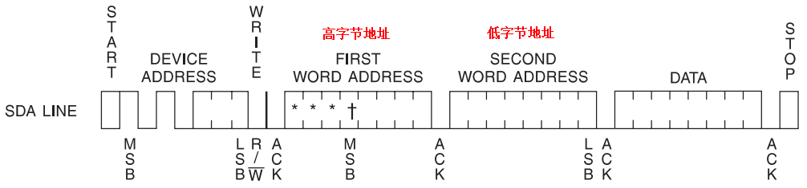
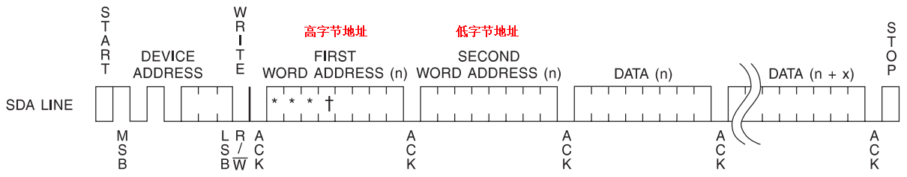
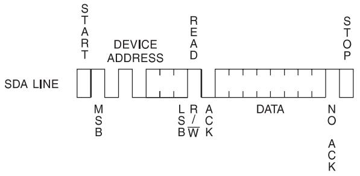
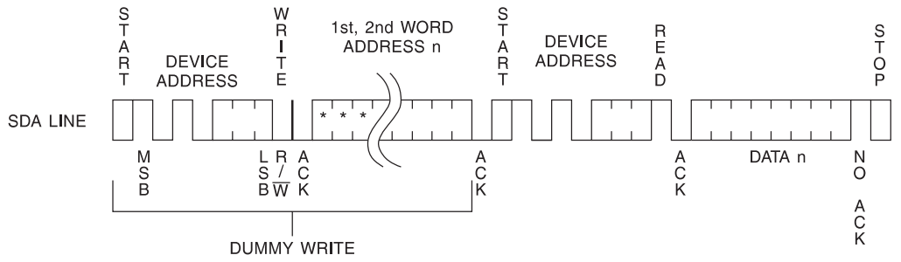
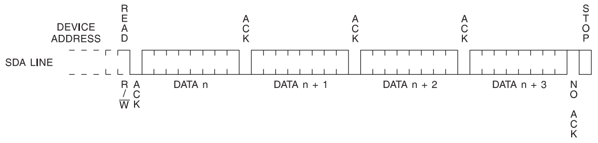

## ESP8266 学习笔记 10 —— IIC 与 AT24C32 RTC实例
作者：Preston_zhu<br>
日期：2020.6.30

### 1. 实例分析

参考 RTOS_SDK/examples/peripherals/i2c
是基于 IIC 控制 AT24C32 RTC 模块

#### i. AT24C32 重点内容分析

参考手册：doc\peripherals\AT24C32.pdf

##### 1) 主要性能参数
> * 提供 32786 bits/4096 bytes 的存储空间
> * 提供写保护引脚，支持硬件数据保护
> * 32bytes 页大小, 256 页
> * 支持 10 万次写入周期
> * 数据保留期限：100 年
> * ESD 保护：>3000V
> * 最多支持一路 IIC 总线扩展 8 个芯片

##### 2) 主要功能引脚说明
| Pin | 名称 | 功能 |
| :--: | :--: | :-- |
| 1 | A0 | 设备地址配置引脚。<br>**A0/A1/A2 可配置硬件连接，或仅保护悬空。硬件配置时，一路 IIC 总线上最多可支持 8 个从设备。如果引脚悬空，则为 0** |
| 2 | A1 | 设备地址配置引脚 |
| 3 | A2 | 设备地址配置引脚 |
| 4 | GND | 电源地 |
| 5 | SDA | IIC 串行数据输入输出引脚。开漏输出，需要外部上拉电阻 |
| 6 | SCL | IIC 串行时钟引脚。开漏输出，需要外部上拉电阻 |
| 7 | WP | 写保护引脚 |
| 8 | VCC | 电源+ |

##### 3) 从设备地址

| Bit7 | Bit6 | Bit5 | Bit4 | Bit3 | Bit2 | Bit1 | Bit0 |
| :--: | :--: | :--: | :--: | :--: | :--: | :--: | :--: |
| 1 | 0 | 1 | 0 | A2 | A1 | A0 | R/W |

* A0/A1/A2 悬空情况下，值为 0。所以默认地址为 1010000 （7 bits）

##### <font color="red">4) 读写操作</font>

**这是 AT24C32 应用的核心内容**

AT24C32 支持多种模式的读写操作

由于 AT24C32 存储单元较多，存储单元地址需要至少 12 位地址位。而 IIC 每次传输只能传输 8 位数据。所以读写操作都需要连续传输两个字节的地址

参考时序图如下：

* 字节写入



地址分两个字节传输，高字节地址，高 4 位其实会被 AT24C32 忽略

* 页写入



页写入最多写入 32 个字节，即页大小

页写入时，地址会自动增加。地址自增位为低 5 位地址，地址只会在 0 - 31 之间变化。因此，限制在了页内写入数据。如果数据写入到页边界，则下一次写入，又会从当前页 0 地址开始。此时即发生了“回滚”操作，回滚后又从当前页的 0 地址进行写入。原来在此位置写入的数据，将会被覆盖

* 当前地址读取



读取当前地址数据，即读取 AT24C32 最后一次操作后，所保存的地址处的数据。此时读取数据，不需要传入地址

* 随机地址读（指定地址读取）



* 序列读（连续数据块读取）



连续读取数据块，只需要指定起始地址，与读取数据块的大小，即可实现连续读取

* 回滚

回滚通常发生在读写数据至页边界，或 AT24C32 存储空间边界时。有如下情况：

a. 写入数据遇到页边界时，会回滚至当前页的 0 地址处。此时如果继续写入，将会覆盖原来写入的数据

b. 读取数据遇到 AT24C32 最后一页的边界时，此时如果继续读取，将会回滚至第 1 页的 0 地址处


#### ii. 主程序分析

```C
/**
 * 说明:
 * 本实例展示如何使用 IIC
 * 使用 IIC 控制 AT24C32 EEPROM 读写
 *
 * GPIO 配置状态:
 * GPIO14 作为主机 SDA 连接至 AT24C32 SDA
 * GPIO2  作为主机 SCL 连接到 AT24C32 SCL
 * 不必要增加外部上拉电阻，驱动程序将使能内部上拉电阻
 *
 * 测试:
 * 如果连接上 AT24C32 EEPROM，测试读写数据
 */
#include <stdio.h>
#include <string.h>
#include <stdlib.h>

#include "freertos/FreeRTOS.h"
#include "freertos/task.h"
#include "freertos/queue.h"

#include "esp_log.h"
#include "esp_system.h"
#include "esp_err.h"

#include "driver/i2c.h"
#include "driver/gpio.h"


static const char *TAG = "AT24C32";

#define I2C_PORT_2_AT24C32			I2C_NUM_0        /*!< 主机设备 IIC 端口号 */

/*
默认 AT24C32 芯片上 A0，A1，A2 引脚为低电平
测量了 AT24C32 模块上的 AT24C23 芯片 A0，A1，A2 引脚都为高电平，所以地址为 0xAE
*/
#define AT24C32_ADDR				0xAE             /*!< 从机 AT24C32 地址 */
#define WRITE_BIT                   I2C_MASTER_WRITE /*!< I2C 主机写操作位 */
#define READ_BIT                    I2C_MASTER_READ  /*!< I2C 主机读操作位 */
#define ACK_CHECK_EN                0x1              /*!< I2C 主机确认接收从机 ACK 信号 */
#define ACK_CHECK_DIS               0x0              /*!< I2C 主机不接收从机 ACK 信号  */
#define ACK_VAL                     0x0              /*!< I2C ACK值 */
#define NACK_VAL                    0x1              /*!< I2C NACK值 */
#define LAST_NACK_VAL               0x2              /*!< I2C 末尾ACK值 */

// 测试读写数据，跨页情况
#define AT24C32_TEST_DATA_LEN		(66)

/* IIC 主机初始化：主机模式，GPIO */
static esp_err_t i2c_module_init(void)
{
	i2c_config_t conf;

	// 主机模式
	conf.mode = I2C_MODE_MASTER;
	// GPIO14 -> SDA
	conf.sda_io_num = GPIO_NUM_14;
	// SDA 引脚上拉
	conf.sda_pullup_en = 0;
	// GPIO2 -> SCL
	conf.scl_io_num = GPIO_NUM_2;
	// SCL 引脚上拉
	conf.scl_pullup_en = 0;

	// 设置 IIC 工作模式
	ESP_ERROR_CHECK(i2c_driver_install(I2C_PORT_2_AT24C32, conf.mode));
	// 设置 IIC 引脚配置
	ESP_ERROR_CHECK(i2c_param_config(I2C_PORT_2_AT24C32, &conf));

	return ESP_OK;
}

static esp_err_t at24c32_init(i2c_port_t i2c_num)
{
	vTaskDelay(100 / portTICK_RATE_MS);

	i2c_module_init();	// 初始化 IIC 接口

	return ESP_OK;
}

static esp_err_t at24c32_write_in_page(i2c_port_t i2c_num, uint16_t reg_address,
									   uint8_t *data, size_t data_len)
{
	int ret = 0;
	// 创建 IIC 命令连接
	i2c_cmd_handle_t cmd = i2c_cmd_link_create();

	// 创建一个命令队列，并装载一个开始信号
	i2c_master_start(cmd);
	// 装载一个从机地址及写指令，ACK 应答使能
	i2c_master_write_byte(cmd, AT24C32_ADDR | WRITE_BIT, ACK_CHECK_EN);
	// 装载从机寄存器地址，ACK应答使能
	i2c_master_write_byte(cmd, (uint8_t)(reg_address >> 8), ACK_CHECK_EN);
	i2c_master_write_byte(cmd, (uint8_t)(reg_address & 0xFF), ACK_CHECK_EN);
	// 装载写至从机寄存器的数据，ACK应答使能
	i2c_master_write(cmd, data, data_len, ACK_CHECK_EN);
	// 装载停止信号
	i2c_master_stop(cmd);

	// 发送命令队列中的数据
	ret = i2c_master_cmd_begin(i2c_num, cmd, 1000 / portTICK_RATE_MS);
	// 释放命令连接
	i2c_cmd_link_delete(cmd);

	return ret;
}

/* 支持跨页写数据 */
static esp_err_t at24c32_write(i2c_port_t i2c_num, uint16_t reg_address,
							  uint8_t *data, size_t data_len)
{
	int ret = 0;
	uint16_t cur_addr = reg_address;
	uint8_t *cur_data = data;
	size_t cur_len = 0;
	size_t last_len = data_len;
	int first_flag = 1;

	cur_len = 32 - ((int)cur_addr % 32);
	last_len = data_len - cur_len;

	for(;;)
	{
		ret = at24c32_write_in_page(i2c_num, cur_addr, cur_data, cur_len);
		if(ESP_OK != ret)
		{
			return ret;
		}

		if(0 == last_len)
		{
			break;
		}

		// 下一页写数据地址
		if(1 == first_flag)
		{
			first_flag = 0;
			cur_addr += cur_len;
			cur_data += cur_len;
		}
		else
		{
			cur_addr += 32;
			cur_data += 32;
		}
		// 下一页写数据长度
		if(last_len > 32)
		{
			cur_len = 32;
			last_len -= 32;
		}
		else
		{
			cur_len = last_len;
			last_len = 0;
		}

		// 跨页写数据时，当前页写完后，需要增加适当的延时，让写入执行完成，再继续写下一页
		vTaskDelay(20 / portTICK_RATE_MS);
	}

	return ret;
}

/* 读数据，是否跨页，都不需要增加延时 */
static esp_err_t at24c32_read(i2c_port_t i2c_num, uint16_t reg_address,
								   uint8_t *data, size_t data_len)
{
	int ret;
	// 创建 IIC 命令连接
	i2c_cmd_handle_t cmd = i2c_cmd_link_create();

	// 给从机发送读数据地址，通知其准备数据
	// 创建一个命令队列，并装载一个开始信号
	i2c_master_start(cmd);
	// 装载一个从机地址及写指令，ACK 应答使能
	i2c_master_write_byte(cmd, AT24C32_ADDR | WRITE_BIT, ACK_CHECK_EN);
	// 装载从机寄存器地址，即待读取数据的寄存器地址，ACK应答使能
	i2c_master_write_byte(cmd, (uint8_t)(reg_address >> 8), ACK_CHECK_EN);
	i2c_master_write_byte(cmd, (uint8_t)(reg_address & 0xFF), ACK_CHECK_EN);

	// 装载停止信号
	i2c_master_stop(cmd);
	// 发送命令队列中的数据
	ret = i2c_master_cmd_begin(i2c_num, cmd, 1000 / portTICK_RATE_MS);
	// 释放命令连接
	i2c_cmd_link_delete(cmd);

	// 验证读取命令是否发送成功
	if(ret != ESP_OK)
	{
		return ret;
	}

	// 主机读取从机发送的数据
	cmd = i2c_cmd_link_create();
	// 创建一个命令队列，并装载一个开始信号
	i2c_master_start(cmd);
	// 装载一个从机地址及读指令，ACK 应答使能
	i2c_master_write_byte(cmd, AT24C32_ADDR | READ_BIT, ACK_CHECK_EN);
	// 装载读取命令，待读取数据缓存区和数据长度，用于从 IIC 总线读取数据，
	// 最后一个数据应答 NACK
	i2c_master_read(cmd, data, data_len, LAST_NACK_VAL);
	// 装载停止信号
	i2c_master_stop(cmd);
	// 发送命令队列中的数据
	// ** 这里不好理解 **
	// 命令队列中装载了读取的信息：缓存区和数据长度，
	// 这里才会真正处理读取数据操作。是阻塞运行。并将读取的数据存储至缓存区
	// 所以程序返回时，数据应该已经读取到缓存区了，可以再取出来用了
	// 多个数据的读取，被封装在底层驱动中了
	ret = i2c_master_cmd_begin(i2c_num, cmd, 1000 / portTICK_RATE_MS);
	// 释放命令连接
	i2c_cmd_link_delete(cmd);

	return ret;
}

static void i2c_task_example(void *arg)
{
	// uint8_t e2p_byte = 0;
	uint8_t e2p_wb[AT24C32_TEST_DATA_LEN];
	int temp = 0;
	int i = 0;

	// 初始化 AT24C32
	at24c32_init(I2C_PORT_2_AT24C32);

	for(;;)
	{
		// 写入并读取一个字节
		// ESP_LOGI(TAG, "Write 1 byte data");
		// e2p_byte = 0;
		// ESP_ERROR_CHECK(at24c32_write_in_page(I2C_PORT_2_AT24C32, 0x00, &temp, 1));
		// // 写之后立即读，需要增加延时，否则读取失败
		// vTaskDelay(20 / portTICK_RATE_MS);
		// at24c32_read(I2C_PORT_2_AT24C32, 0x00, &e2p_byte, 1);
		// ESP_LOGI(TAG, "Read E2PROM data at [0]: %X", e2p_byte);
		// ++temp;

		ESP_LOGI(TAG, "Write block data");
		// 跨页写入并读取数据
		for(i = 0; i < AT24C32_TEST_DATA_LEN; ++i)
		{
			e2p_wb[i] = temp++;
			printf("%02X ", e2p_wb[i]);
		}
		printf("\n");
		ESP_ERROR_CHECK(at24c32_write(I2C_PORT_2_AT24C32, 0x02, e2p_wb, AT24C32_TEST_DATA_LEN));

		// 写之后立即读，需要增加延时，否则读取失败
		vTaskDelay(20 / portTICK_RATE_MS);

		memset(e2p_wb, 0, AT24C32_TEST_DATA_LEN);
		// 跨页读，不需要延时
		ESP_ERROR_CHECK(at24c32_read(I2C_PORT_2_AT24C32, 0x02, e2p_wb, AT24C32_TEST_DATA_LEN));
		for(i = 0; i < AT24C32_TEST_DATA_LEN; ++i)
		{
			printf("%02X ", e2p_wb[i]);
		}
		printf("\n\n");

		vTaskDelay(5000 / portTICK_RATE_MS);
	}

	i2c_driver_delete(I2C_PORT_2_AT24C32);
}

void app_main(void)
{
	xTaskCreate(i2c_task_example, "i2c_task_example", 2048, NULL, 10, NULL);
}
```

#### iii. 打印输出

```shell
I (360) reset_reason: RTC reset 1 wakeup 0 store 0, reason is 1
I (460) gpio: GPIO[14]| InputEn: 0| OutputEn: 1| OpenDrain: 1| Pullup: 0| Pulldown: 0| Intr:0
I (460) gpio: GPIO[2]| InputEn: 0| OutputEn: 1| OpenDrain: 1| Pullup: 0| Pulldown: 0| Intr:0
I (470) AT24C32: Write block data
00 01 02 03 04 05 06 07 08 09 0A 0B 0C 0D 0E 0F 10 11 12 13 14 15 16 17 18 19 1A 1B 1C 1D 
1E 1F 20 21 22 23 24 25 26 27 28 29 2A 2B 2C 2D 2E 2F 30 31 32 33 34 35 36 37 38 39 3A 3B 
3C 3D 3E 3F 40 41
00 01 02 03 04 05 06 07 08 09 0A 0B 0C 0D 0E 0F 10 11 12 13 14 15 16 17 18 19 1A 1B 1C 1D 
1E 1F 20 21 22 23 24 25 26 27 28 29 2A 2B 2C 2D 2E 2F 30 31 32 33 34 35 36 37 38 39 3A 3B 
3C 3D 3E 3F 40 41

I (5590) AT24C32: Write block data
42 43 44 45 46 47 48 49 4A 4B 4C 4D 4E 4F 50 51 52 53 54 55 56 57 58 59 5A 5B 5C 5D 5E 5F 
60 61 62 63 64 65 66 67 68 69 6A 6B 6C 6D 6E 6F 70 71 72 73 74 75 76 77 78 79 7A 7B 7C 7D 
7E 7F 80 81 82 83
42 43 44 45 46 47 48 49 4A 4B 4C 4D 4E 4F 50 51 52 53 54 55 56 57 58 59 5A 5B 5C 5D 5E 5F 
60 61 62 63 64 65 66 67 68 69 6A 6B 6C 6D 6E 6F 70 71 72 73 74 75 76 77 78 79 7A 7B 7C 7D 
7E 7F 80 81 82 83 

I (10690) AT24C32: Write block data
84 85 86 87 88 89 8A 8B 8C 8D 8E 8F 90 91 92 93 94 95 96 97 98 99 9A 9B 9C 9D 9E 9F A0 A1 
A2 A3 A4 A5 A6 A7 A8 A9 AA AB AC AD AE AF B0 B1 B2 B3 B4 B5 B6 B7 B8 B9 BA BB BC BD BE BF 
C0 C1 C2 C3 C4 C5
84 85 86 87 88 89 8A 8B 8C 8D 8E 8F 90 91 92 93 94 95 96 97 98 99 9A 9B 9C 9D 9E 9F A0 A1 
A2 A3 A4 A5 A6 A7 A8 A9 AA AB AC AD AE AF B0 B1 B2 B3 B4 B5 B6 B7 B8 B9 BA BB BC BD BE BF 
C0 C1 C2 C3 C4 C5
```

#### iv. 遇到的问题记录
1.
写入数据之后再立即读取，需要添加延时，不然无法正确读取出来。实例中添加了 20ms 的延时

2.
写入数据时，需要注意数据量是不是超过了单页大小 (32bytes)。如果写数据超过页大小，则写完每页的数据后，需要添加适当的延时，以保证数据写入完成

读取数据跨页时，则不需要添加延时

### 2. 其它实例测试
#### i. 读写 1 字节数据

在 0x00 位置写入 1 个字节，然后再读取出来。写的内容逐步递增。如下所示：

```shell
I (374) reset_reason: RTC reset 1 wakeup 0 store 0, reason is 1
I (474) gpio: GPIO[14]| InputEn: 0| OutputEn: 1| OpenDrain: 1| Pullup: 0| Pulldown: 0| Intr:0
I (474) gpio: GPIO[2]| InputEn: 0| OutputEn: 1| OpenDrain: 1| Pullup: 0| Pulldown: 0| Intr:0
I (484) AT24C32: Write 1 byte data
I (514) AT24C32: Read E2PROM data at [0]: 0
I (5514) AT24C32: Write 1 byte data
I (5534) AT24C32: Read E2PROM data at [0]: 1
I (10534) AT24C32: Write 1 byte data
I (10554) AT24C32: Read E2PROM data at [0]: 2
I (15554) AT24C32: Write 1 byte data
I (15574) AT24C32: Read E2PROM data at [0]: 3
I (20574) AT24C32: Write 1 byte data
I (20594) AT24C32: Read E2PROM data at [0]: 4
I (25594) AT24C32: Write 1 byte data
I (25614) AT24C32: Read E2PROM data at [0]: 5
```