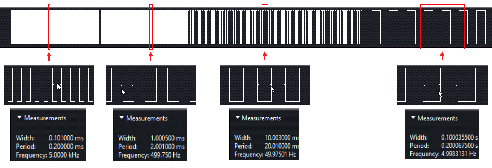

## ESP8266 学习笔记 5 —— hw_timer 实例
作者：Preston_zhu<br>
日期：2020.6.20

### 1. hw_timer 实例

参考 RTOS_SDK/examples/peripherals/hw_timer

此处实例在原例程上进行了精减，方便学习与理解

#### i. 流程

* 配置 GPIO 引脚：GPIO15
* 初始化 hw_timer，并注册中断服务函数/回调函数
* 设置定时器报警时间 us, 控制模式，并启动定时器
* 输出周期 200us(5000Hz) 的方波 1s
* 重置定时器
* 输出周期 2ms 的方波 1s
* 输出周期 20ms 的方波 2s
* 输出周期 200ms 的方波 3s
* 禁止/停止定时器
* 重置定时器
* 定时器 1ms 后关闭 LED1

#### ii. 主程序分析

```C
/* main/user_main.c */
#include <stdio.h>

#include "freertos/FreeRTOS.h"
#include "freertos/task.h"
#include "freertos/queue.h"

#include "esp_log.h"

#include "driver/gpio.h"
/* hw_timer 驱动 */
#include "driver/hw_timer.h"

static const char *TAG = "hw_timer_example";

/* 仅一次触发 */
#define TEST_ONE_SHOT	false
/* 重载模式 */
#define TEST_RELOAD		true

/**
 * 说明:
 * 本实例展示如何使用 HW_Timer 定时器
 * 使用 HW_TImer 产生不同频率的波形
 *
 * GPIO 配置状态:
 * GPIO15: 输出
 *
 * 测试:
 * 连接 GPIO15 至 LED1
 * 在 GPIO15 产生不同频率的方形波形输出, 由此来控制 LED
 */

void hw_timer_callback1(void *arg)
{
	static int state = 0;

	gpio_set_level(GPIO_NUM_15, (state ++) % 2);
}

void hw_timer_callback2(void *arg)
{
	static int state = 0;

	gpio_set_level(GPIO_NUM_15, (state ++) % 2);
}

void hw_timer_callback3(void *arg)
{
	gpio_set_level(GPIO_NUM_15, 0);
}

void app_main(void)
{
	gpio_config_t io_conf;
	
	io_conf.intr_type = GPIO_INTR_DISABLE;
	io_conf.mode = GPIO_MODE_OUTPUT;
	io_conf.pin_bit_mask = GPIO_Pin_15;
	io_conf.pull_down_en = 0;
	io_conf.pull_up_en = 0;
	gpio_config(&io_conf);
	
	// 输出周期 200us(5000Hz) 的方波 1s
	ESP_LOGI(TAG, "Initialize hw_timer for callback1");
	// 初始化 HW_Timer，注册回调函数
	hw_timer_init(hw_timer_callback1, NULL);
	ESP_LOGI(TAG, "Set hw_timer timing time 100us with reload");
	// 设置定时器报警中断 100us，重载模式，启动定时器
	hw_timer_alarm_us(100, TEST_RELOAD);
	// 延时 1s，即让定时器运行 1s
	vTaskDelay(1000 / portTICK_RATE_MS);

	ESP_LOGI(TAG, "-");
	ESP_LOGI(TAG, "Deinitialize hw_timer for callback1");
	// 重置定时器
	hw_timer_deinit();

	// 输出周期 2ms 的方波 1s
	ESP_LOGI(TAG, "-");
	ESP_LOGI(TAG, "Initialize hw_timer for callback2");
	// 初始化定时器，注册回调函数
	hw_timer_init(hw_timer_callback2, NULL);
	ESP_LOGI(TAG, "Set hw_timer timing time 1ms with reload");
	// 设置定时器报警中断 1ms，重载模式，重新启动定时器
	hw_timer_alarm_us(1000, TEST_RELOAD);
	// 延时 1s，即让定时器运行 1s
	vTaskDelay(1000 / portTICK_RATE_MS);
	
	// 输出周期 20ms 的方波 2s
	ESP_LOGI(TAG, "-");
	ESP_LOGI(TAG, "Set hw_timer timing time 10ms with reload");
	// 设置定时器报警中断 10ms，重载模式，重新启动定时器
	hw_timer_alarm_us(10000, TEST_RELOAD);
	// 延时 2s，即让定时器运行 2s
	vTaskDelay(2000 / portTICK_RATE_MS);
	
	// 输出周期 200ms 的方波 3s
	ESP_LOGI(TAG, "-");
	ESP_LOGI(TAG, "Set hw_timer timing time 100ms with reload");
	// 设置定时器报警中断 100ms，重载模式，重新启动定时器
	hw_timer_alarm_us(100000, TEST_RELOAD);
	// 延时 3s，即让定时器运行 3s
	vTaskDelay(3000 / portTICK_RATE_MS);

	ESP_LOGI(TAG, "-");
	ESP_LOGI(TAG, "Cancel timing");
	// 禁止/停止定时器
	hw_timer_disarm();
	// 重置定时器
	hw_timer_deinit();
	
	// 定时器 1ms 后关闭 LED1
	ESP_LOGI(TAG, "-");
	ESP_LOGI(TAG, "Initialize hw_timer for callback3");
	// 初始化定时器
	hw_timer_init(hw_timer_callback3, NULL);
	ESP_LOGI(TAG, "Set hw_timer timing time 1ms with one-shot");
	// 设置定时器报警中断 1ms，单次模式，启动定时器
	hw_timer_alarm_us(1000, TEST_ONE_SHOT);   
}
```

#### iii. 打印输出

```shell
I (374) gpio: GPIO[12]| InputEn: 0| OutputEn: 1| OpenDrain: 0| Pullup: 0| Pulldown: 0| Intr:0 
I (384) gpio: GPIO[15]| InputEn: 0| OutputEn: 1| OpenDrain: 0| Pullup: 0| Pulldown: 0| Intr:0 
I (394) hw_timer_example: Initialize hw_timer for callback1
I (404) hw_timer_example: Set hw_timer timing time 100us with reload
I (1414) hw_timer_example: -
I (1414) hw_timer_example: Deinitialize hw_timer for callback1
I (1414) hw_timer_example: -
I (1424) hw_timer_example: Initialize hw_timer for callback2
I (1424) hw_timer_example: Set hw_timer timing time 1ms with reload
I (2434) hw_timer_example: -
I (2434) hw_timer_example: Set hw_timer timing time 10ms with reload
I (4434) hw_timer_example: -
I (4434) hw_timer_example: Set hw_timer timing time 100ms with reload
I (7434) hw_timer_example: -
I (7434) hw_timer_example: Cancel timing
I (7434) hw_timer_example: -
I (7434) hw_timer_example: Initialize hw_timer for callback3
I (7444) hw_timer_example: Set hw_timer timing time 1ms with one-shot
```

#### iv. 图解



#### v. hw_timer 应用代码流程


##### vi. 疑问
**好像只有一个硬件定时器，暂时没有看到资料说明？？**

### 3. API

#### i.头文件：`esp266/include/driver/hw_timer.h`

#### ii.函数概览：

```C
esp_err_t hw_timer_set_clkdiv(hw_timer_clkdiv_t clkdiv);
uint32_t hw_timer_get_clkdiv();
esp_err_t hw_timer_set_intr_type(hw_timer_intr_type_t intr_type);
uint32_t hw_timer_get_intr_type();
esp_err_t hw_timer_set_reload(bool reload);
bool hw_timer_get_reload();
esp_err_t hw_timer_enable(bool en);
bool hw_timer_get_enable();
esp_err_t hw_timer_set_load_data(uint32_t load_data;
uint32_t hw_timer_get_load_data();
uint32_t hw_timer_get_count_data();
esp_err_t hw_timer_deinit(void);
esp_err_t hw_timer_init(hw_timer_callback_t callback, void *arg);
esp_err_t hw_timer_alarm_us(uint32_t value, bool reload);
esp_err_t hw_timer_disarm(void);
```

#### iii.函数说明：

```C
esp_err_t hw_timer_set_clkdiv(hw_timer_clkdiv_t clkdiv)
```
设置硬件定时器分频系数

返回值：

* `ESP_OK` - 成功
* `ESP_ERR_INVALID_ARG` - 参数错误
* `ESP_FAIL` - 硬件定时器已经初始化

参数：

* `clkdiv` - 分频系数

```C
uint32_t hw_timer_get_clkdiv()
```
获取硬件定时器分频系数

返回值：

* `0` - `TIMER_CLKDIV_1` 1 分频/不分频
* `4` - `TIMER_CLKDIV_16` 16 分频
* `8` - `TIMER_CLKDIV_256` 256 分频

```C
esp_err_t hw_timer_set_intr_type(hw_timer_intr_type_t intr_type)
```
设置硬件定时器中断触发类型

返回值：

* `ESP_OK` - 成功
* `ESP_ERR_INVALID_ARG` - 参数错误
* `ESP_FAIL` - 硬件定时器已经初始化

参数：

* `intr_type` - 中断触发类型

```C
uint32_t hw_timer_get_intr_type()
```
获取硬件定时器中断触发类型

返回值：

* `0` - `TIMER_EDGE_INT` 边缘触发
* `1` - `TIMER_LEVEL_INT` 电平触发

```C
esp_err_t hw_timer_set_reload(bool reload)
```
使能硬件定时器重载模式

返回值：

* `ESP_OK` - 成功
* `ESP_FAIL` - 硬件定时器已经初始化

参数：

* `reload` - `false`, 单次模式; `true`, 重载模式

```C
bool hw_timer_get_reload()
```
获取硬件定时器运行模式：重载模式 或 单次模式

返回值：

* `true` - 重载模式
* `false` - 单次模式

```C
esp_err_t hw_timer_enable(bool en)
```
使能硬件定时器

返回值：

* `ESP_OK` - 成功
* `ESP_FAIL` - 硬件定时器已经初始化

参数：

* `en` - `false`, 硬件定时器禁止; `true`, 硬件定时器使能

```C
bool hw_timer_get_enable()
```
获取硬件定时器使能状态

返回值：

* `true` - 硬件定时器已经初始化
* `false` - 硬件定时器未初始化

```C
esp_err_t hw_timer_set_load_data(uint32_t load_data)
```
设置硬件定时器装载初值

返回值：

* `ESP_OK` - 成功
* `ESP_ERR_INVALID_ARG` - 参数错误
* `ESP_FAIL` - 硬件定时器已经初始化

参数：

* `load_data` - 硬件定时器装载初值
  * FRC1 硬件定时器，范围：小于 0x1000000

```C
uint32_t hw_timer_get_load_data()
```
获取硬件定时器装载初值
返回装载初值

```C
uint32_t hw_timer_get_count_data()
```
获取硬件定时器当前计数值
返回当前计数值

```C
esp_err_t hw_timer_deinit(void)
```
重置(deinit)硬件定时器，可以理解为清除所有硬件定时器配置，并停止定时器

返回值：

* `ESP_OK` - 成功
* `ESP_FAIL` - 硬件定时器未初始化

```C
esp_err_t hw_timer_init(hw_timer_callback_t callback, void *arg)
```
初始化硬件定时器

返回值：

* `ESP_OK` - 成功
* `ESP_ERR_INVALID_ARG` - 参数错误
* `ESP_FAIL` - 硬件定时器已经初始化

参数：

* `callback` - 用户回调函数，即硬件定时器中断处理函数
* `arg` - 传至中断处理函数的参数

```C
esp_err_t hw_timer_alarm_us(uint32_t value, bool reload)
```
设置硬件定时器报警中断的时间 us，同时使能/启动定时器

返回值：

* `ESP_OK` - 成功
* `ESP_ERR_INVALID_ARG` - 参数错误
* `ESP_FAIL` - 硬件定时器未初始化

参数：

* `value` -
  * 如果参数 `reload` 为 `true`，取值范围为：50 ~ 0x199999
  * 如果参数 `reload` 为 `false`，取值范围为: 10 ~ 0x199999
* `reload` - 
  * `false` : 单次模式，定时器仅产品一次中断后自动停止
  * `true` : 重载模式，定时器自动重载，中断触发多次，直至手动停止

```C
esp_err_t hw_timer_disarm(void)
```
禁止硬件定时器

返回值：

* `ESP_OK` - 成功
* `ESP_FAIL` - 硬件定时器未初始化

---

宏
```C
TIMER_BASE_CLK
```

类型定义
```C
// 定时器中断服务函数指针
typedef void (*hw_timer_callback_t)(void *arg)
```

枚举
```C
enum hw_timer_clkdiv_t
	// 定时器 1 分频
	TIMER_CLKDIV_1 = 0
	// 定时器 16分频
	TIMER_CLKDIV_16 = 4
	// 定时器 256 分频
	TIMER_CLKDIV_256 = 8
```

```C
enum hw_timer_intr_type_t
	// 定时器中断边缘触发
	TIMER_EDGE_INT = 0
	// 定时器中断电平触发
	TIMER_LEVEL_INT = 1
```
