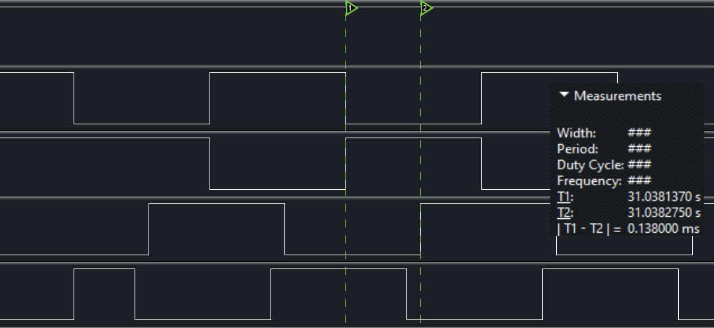
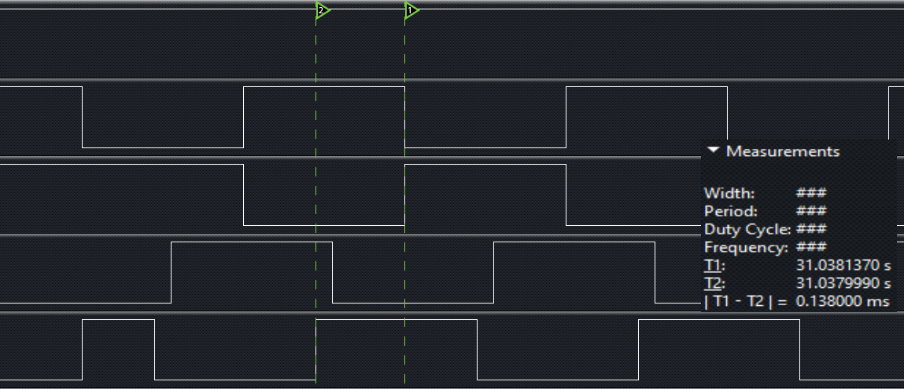
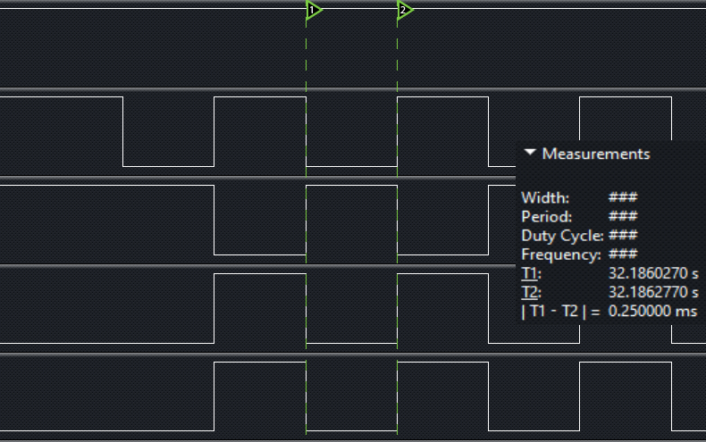
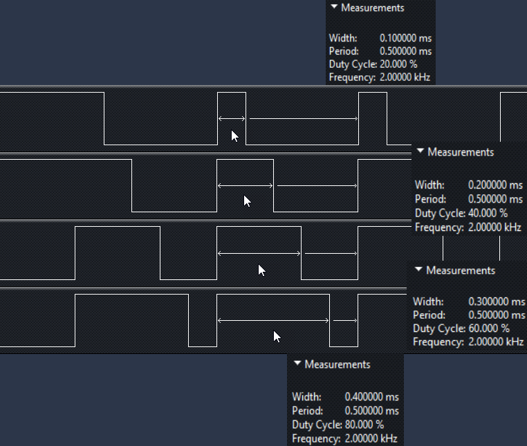
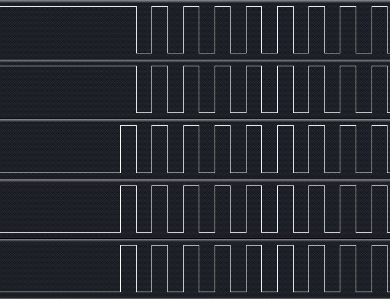

## ESP8266 学习笔记 6 —— PWM 实例
作者：Preston_zhu<br>
日期：2020.6.21

### 0. PWM 硬件描述
ESP8266 有 4 个PWM 输出接口/通道。如下表
| 管脚名称 | 管脚编号 | IO | 功能名称 |
| ---- | ---- | ---- | ---- |
| MTDI | 10 | IO12 | PWM0 |
| MTDO | 13 | IO15 | PWM1 |
| MTMS | 9 | IO14 | PWM2 |
| GPIO4 | 16 | IO4 | PWM3 |
注意：此处资料与实例中有差别？？
PWM 功能由 FRC1 在软件上实现。(推断 PWM 与输出引脚无关，因为是软件实现)

> FRC1 是一个 23bit 的硬件定时器

PWM 特性：
* 使用 NMI (NOn Maskable Interrupt) 中断，NMI 拥有最高中断优先级，可保证 PWM 输出波形的准确度
* 可扩展最多 8 路 PWM 信号
* &gt;14 bit 分辨率，最小分辨率 45ns

> 注意：
> * PWM 驱动接口不能与硬件定时器 hw_timer 接口函数同时使用，因为二者共用同一个硬件定时器
> * 如果使用 PWM 驱动，请勿调用 `wifi_set_sleep_type(LIGT_SLEEP)` 函数将自动睡眠模式设置为 Light Sleep 模式。因为 Light Sleep 模式在睡眠基本会停 CPU，停 CPU 期间不能响应 NMI 中断，会影响 PWM 输出
> * 如需进入 Deep Sleep，请先将 PWM 关闭，再进行休眠

PWM 的时钟由高速系统时钟提供，其频率高达 80 MHz。 PWM 通过预分频器将时钟源 16 分频，其输入时间频率为 5 MHz。PWM 通过 FRC1 来产生粗调定时，结合高速系统时钟的微调，可将分辨率提高到 45ns

参数说明：
* 最小分辨率：45ns （近似对应于硬件 PWM 的输入时钟频率为22.72 MHz）： &gt;14 bit PWM @ 1kHz
* PWM 周期：1000us (1kHz) ~ 10000 us(100Hz)


### 1. PWM 实例

参考 RTOS_SDK/examples/peripherals/pwm
在原实例上做了修改，方便理解内容

#### i. 流程

* 初始化 PWM，设定 PWM 周期，占空比，通道数和输出引脚
* 设置 PWM 反转输出通道
* 设置 PWM 输出相位
* 开启 PWM 输出
* 输出 5s PWM，停止 PWM 5s，然后再开启/停止，一直重复 ...

#### ii. 主程序分析

```C
/**
 * 说明:
 * 本实例展示如何使用 PWM
 * 使用 4 路 PWM 输出波形
 *
 * GPIO 配置状态:
 * GPIO12: PWM 通道 0 输出
 * GPIO13: PWM 通道 1 输出
 * GPIO14: PWM 通道 2 输出
 * GPIO15: PWM 通道 3 输出
 *
 * 测试:
 * 连接 GPIO12/13/14/15 至 逻辑分析仪
 * 在 GPIO 产生相同频率的方形波形，各个波形可能相位或占空比不一样
 */
#include <stdio.h>
#include <string.h>
#include <stdlib.h>

#include "freertos/FreeRTOS.h"
#include "freertos/task.h"
#include "freertos/queue.h"

#include "esp_log.h"
#include "esp_system.h"
#include "esp_err.h"

/* pwm 驱动 */
#include "driver/gpio.h"
#include "driver/pwm.h"

// PWM 周期 500us(2Khz)
#define PWM_CHANNEL_NUM     (4)
#define PWM_PERIOD          (500)

static const char *TAG = "pwm_example";

// pwm 引脚号
const uint32_t pin_num[PWM_CHANNEL_NUM] = {
    GPIO_NUM_12,
    GPIO_NUM_13,
    GPIO_NUM_14,
    GPIO_NUM_15
};

// 占空比 duty 表
// 占空比：说明高电平在一个周期里的占比时间
uint32_t duties[PWM_CHANNEL_NUM] = {
    250, 250, 250, 250
};

// 相位 phase 表
// 相位：即同频率波形起点位置的时间差
int16_t phase[PWM_CHANNEL_NUM] = {
    0, 0, 50, -50
};

void app_main()
{
    int16_t count = 0;

    // PWM 初始化
    pwm_init(PWM_PERIOD, duties, PWM_CHANNEL_NUM, pin_num);
    // 设置 PWM 通道 0 反转输出，所以 通道 1 可作为参考输出
    pwm_set_channel_invert(0x1 << 0);
    // 设置 PWM 相位
    // 即使用希望相位为 0，也必需要配置为 0
    pwm_set_phases(phase);
    // 开启 PWM
    pwm_start();

    // PWM 输出 5s，停止 5s，输出 5s，停止 5s ... ...
    while(1)
    {
        // PWM 运行 5s
        if(count == 5)
        {
            // 0x3 : b0011
            // PWM 通道 0，1 输出高电平
            // PWM 通道 2，3 输出低电平
            pwm_stop(0x3);
            ESP_LOGI(TAG, "PWM stop\n");
        }
        // 等待 5s，重新启动 PWM
        else if(count == 10)
        {
            pwm_start();
            ESP_LOGI(TAG, "PWM re-start\n");
            count = 0;
        }

        count++;
        vTaskDelay(1000 / portTICK_RATE_MS);
    }
}
```

#### iii. 打印输出

```shell
I (359) reset_reason: RTC reset 1 wakeup 0 store 0, reason is 1
I (359) gpio: GPIO[12]| InputEn: 0| OutputEn: 1| OpenDrain: 0| Pullup: 0| Pulldown: 0| Intr:0
I (369) gpio: GPIO[13]| InputEn: 0| OutputEn: 1| OpenDrain: 0| Pullup: 0| Pulldown: 0| Intr:0
I (389) gpio: GPIO[14]| InputEn: 0| OutputEn: 1| OpenDrain: 0| Pullup: 0| Pulldown: 0| Intr:0
I (399) gpio: GPIO[15]| InputEn: 0| OutputEn: 1| OpenDrain: 0| Pullup: 0| Pulldown: 0| Intr:0
I (409) pwm: --- PWM v3.0

I (5419) pwm_example: PWM stop

I (10419) pwm_example: PWM re-start

I (15419) pwm_example: PWM stop

I (20419) pwm_example: PWM re-start

I (25419) pwm_example: PWM stop

I (30419) pwm_example: PWM re-start

I (35419) pwm_example: PWM stop

```

#### iv. 图解
间隔周期 5s

通道 3 波形迟通道 2 波形 138us

通道 4 波形早通道 2 波形 138us

**时间差计算见后文**

#### v. PWM 应用代码流程


##### vi. 疑问
**既然 PWM 是由软件实现，PWM 输出口可以指定 GPIO 引脚，为什么官方文档里还是提及 PWM 有4个通道？？**

### 3. API

#### i.头文件：`esp266/include/driver/pwm.h`

#### ii.函数概览：

```C
esp_err_t pwm_init(uint32_t period, uint32_t *duties, uint8_t channel_num, const uint32_t *pin_num)
esp_err_t pwm_deinit(void)
esp_err_t pwm_set_duty(uint8_t channel_num, uint32_t duty)
esp_err_t pwm_get_duty(uint8_t channel_num, uint32_t *duty_p)
esp_err_t pwm_set_period(uint32_t period)
esp_err_t pwm_get_period(uint32_t *period_p)
esp_err_t pwm_start(void)
esp_err_t pwm_stop(uint32_t stop_level_mask)
esp_err_t pwm_set_duties(uint32_t *duties)
esp_err_t pwm_set_phase(uint8_t channel_num, int16_t phase)
esp_err_t pwm_set_phases(int16_t *phases)
esp_err_t pwm_get_phase(uint8_t channel_num, uint16_t *phase_p)
esp_err_t pwm_set_period_duties(uint32_t period, uint32_t *duties)
esp_err_t pwm_set_channel_invert(uint16_t channel_mask)
esp_err_t pwm_clear_channel_invert(uint16_t channel_mask)
```

#### iii.函数说明：

```C
esp_err_t hw_timer_set_clkdiv(hw_timer_clkdiv_t clkdiv)
```
设置硬件定时器分频系数

返回值：

* `ESP_OK` - 成功
* `ESP_ERR_INVALID_ARG` - 参数错误
* `ESP_FAIL` - 硬件定时器已经初始化

参数：

* `clkdiv` - 分频系数

```C
esp_err_t pwm_init(uint32_t period, uint32_t *duties, uint8_t channel_num, const uint32_t *pin_num)
```
PWM 功能初始化，包括初始化 GPIO，频率和占空比

返回值：

* `ESP_OK` - 成功
* `ESP_ERR_INVALID_ARG` - 参数错误
* `ESP_FAIL` - 初始化错误

参数：

* `period` - PWM 周期，单位 us。例如 1KHz PWM，周期 1000us。周期值不能低于 20us。
* `duties` - 各个 PWM 通道的占空比。数组，元素个数与 PWM 通道配置个数对应
* `channel_num` - PWM 通道号，最大值为 8
* `pin_num` - PWM 通道对应 GPIO 引脚号, 为一个存储了 PWM 通道对应的 GPIO 引脚号的数组

```C
esp_err_t pwm_deinit(void)
```
重置 PWM

返回值：

* `ESP_OK` - 成功
* `ESP_FAIL` - 初始化错误

```C
esp_err_t pwm_set_duty(uint8_t channel_num, uint32_t duty)
```
设置 PWM 指定通道的占空比值。即设置高电平信号持续时长（或反转输出时低电平持续时长），占空比值不能超过周期值。
注意：需要在配置 PWM 之后，调用 `pwm_start()` 函数，使设置生效

返回值：

* `ESP_OK` - 成功
* `ESP_ERR_INVALID_ARG` - 参数错误

参数：

* `channel_num` - PWM 通道号，不能超过初始化时所设置的通道数
* `duty` - duty cycle

```C
esp_err_t pwm_get_duty(uint8_t channel_num, uint32_t *duty_p)
```
获取 PWM 指定通道占空比值

返回值：

* `ESP_OK` - 成功
* `ESP_ERR_INVALID_ARG` - 参数错误

参数：

* `channel_num` - PWM 通道号，不能超过初始化时所设置的通道数
* `duty_p` - 指针，存储获取指定通道占空比值

```C
esp_err_t pwm_set_period(uint32_t period)
```
设置 PWM 周期，单位 us
注意：需要在配置 PWM 之后，调用 `pwm_start()` 函数，使设置生效

返回值：

* `ESP_OK` - 成功
* `ESP_ERR_INVALID_ARG` - 参数错误

参数：

* `period`: PWM 周期，单位 us。例如： 1kHz PWM，周期为 1000us。周期不能小于 20us

```C
esp_err_t pwm_get_period(uint32_t *period_p)
```
获取 PWM 周期，单位 us

返回值：

* `ESP_OK` - 成功
* `ESP_ERR_INVALID_ARG` - 参数错误

参数：

* `period_p` - 指针，存储获取的周期值

```C
esp_err_t pwm_start(void)
```
开启 PWM
注意：此函数必需在 PWM 配置改变之后调用

返回值：

* `ESP_OK` - 成功
* `ESP_ERR_INVALID_ARG` - 参数错误

```C
esp_err_t pwm_stop(uint32_t stop_level_mask)
```
停止所有 PWM 通道。停止 PWM 并且设置各个通道的输出电平。调用 pwm_start() 函数可以重新开启 PWM 输出

返回值：

* `ESP_OK` - 成功
* `ESP_ERR_INVALID_ARG` - 参数错误

参数：

* `stop_level_mask` - PWM 停止后，GPIO 引脚上的输出电平。
  * 例如：假设初始化了 8 个 PWM 通道，如果 `stop_level_mask` = 0x0F，PWM 停止后，通道 0，1，2，3 会输出高电平，而通道 4,5,6,7 则会输出低电平

```C
esp_err_t pwm_set_duties(uint32_t *duties)
```
设置 PWM 所有通道的占空比
注意：需要在配置 PWM 之后，调用 `pwm_start()` 函数，使设置生效

返回值：

* `ESP_OK` - 成功
* `ESP_ERR_INVALID_ARG` - 参数错误

参数：

* `duties` - 数组，存储各个通道的占空比值，数组元素值个数需要与所设置的通道数相等

```C
esp_err_t pwm_set_phase(uint8_t channel_num, int16_t phase)
```
设置 PWM 指定通道的相位
注意：需要在配置 PWM 之后，调用 `pwm_start()` 函数，使设置生效

返回值：

* `ESP_OK` - 成功
* `ESP_ERR_INVALID_ARG` - 参数错误

参数：

* `channel_num` - PWM 通道号，不能超过初始化时所设置的通道数
* `phase` - PWM 指定通道的相位值，相位值范围：(-180, 180)，不包含+/-180

```C
esp_err_t pwm_set_phases(int16_t *phases)
```
设置所有 PWM 通道 的相位
注意：需要在配置 PWM 之后，调用 `pwm_start()` 函数，使设置生效

返回值：

* `ESP_OK` - 成功
* `ESP_ERR_INVALID_ARG` - 参数错误

参数：

* `phases` - 数组，存储各个通道的相位值，数组元素值个数需要与所设置的通道数相等

```C
esp_err_t pwm_get_phase(uint8_t channel_num, uint16_t *phase_p)
```
获取 PWM 指定通道的相位值

返回值：

* `ESP_OK` - 成功
* `ESP_ERR_INVALID_ARG` - 参数错误

参数：

* `channel_num` - PWM 通道号，不能超过初始化时所设置的通道数
* `phase_p` - 指针，存储获取到的通道相位值

```C
esp_err_t pwm_set_period_duties(uint32_t period, uint32_t *duties)
```
设置 PWM 各通道的周期和占空比参数
注意：需要在配置 PWM 之后，调用 `pwm_start()` 函数，使设置生效

返回值：

* `ESP_OK` - 成功
* `ESP_ERR_INVALID_ARG` - 参数错误

参数：

* `period` - PWM 周期参数，单位 us。例如：1kHz PWM，周期为 1000us
* `duties` - 数组，存储各个通道的占空比值，数组元素个数需要与所设置的通道数相等

```C
esp_err_t pwm_set_channel_invert(uint16_t channel_mask)
```
设置 PWM 反转输出通道
注意：需要在配置 PWM 之后，调用 `pwm_start()` 函数，使设置生效

返回值：

* `ESP_OK` - 成功
* `ESP_ERR_INVALID_ARG` - 参数错误

参数：

* `channel_mask` - 通道位掩码，设置反转输出通道
  * 例如：假设初始化了 8 个 PWM 通道，如果 `channel_mask` = 0x0F，则通道 0，1，2，3 会反转输出，而通道 4，5，6，7 则正常输出

```C
esp_err_t pwm_clear_channel_invert(uint16_t channel_mask)
```
清除 PWM 通道反转输出设置。此函数只有当 PWM 通道已经设置为反转输出时才有效
注意：需要在配置 PWM 之后，调用 `pwm_start()` 函数，使设置生效

返回值：

* `ESP_OK` - 成功
* `ESP_ERR_INVALID_ARG` - 参数错误

参数：

* `channel_mask` - 通道位掩码，设置为需要清除的通道
  * 例如：假设初始化了 8 个通道，且通道 0，1，2，3 均已经设置为反转输出通道，如果 `channel_mask` = 0x07，则通道 0，1，2 会设置成正常输出，通道 3 则保持反转输出

### 4. 相位计算

周期T：period，单位：s

频率f：frequency = 1 / 周期

相位：Phase = 2&pound;f

相位范围应当为：(-180, 180)

相位差：针对同频率波形而言

简单的理解，就是两个波形（周期性）相对应部分的时间差，例如起始位置的时间差

实例中，设置了相位差分别为：0，0，50，-50，则对应计算 4 个通道输出波形时间差为：
* 通道 0：时间差 = 0s
* 通道 1：时间差 = 0s
* 通道 2：时间差 = 50 / 180 x 500us = 138us
* 通道 3：时间差 = 250us - 50 / 180 x 500us = 112us

这里有个疑问：

相位计算取的半个周期： 50 度 / 180 度，然后使用了一个周期的时间 500us，计算的值与实际的值一致。为什么不是用半个周期的时间 250us 呢？
猜想：应该是因为此方波没有负半轴的波形，相位只有 180 度

### 5. 其它实例测试
#### i. 特殊相位差实例

相位参数为 (0, 0, 90, -90) 

从图可知：
通道 2 波形与通道 3 和 4 均差半个波形，因为相位相差 90 度
通道 3 与 4 则波形相同，因为相位相关 180 度

#### ii. 不同占空比实例

占空比参数为 (100, 200, 300, 400)


#### iii. 下图为实例输出五个通道

具体参数为：
* GPIO：12/13/14/15/16  
* 占空比：(250, 250, 250, 250, 250)
* 相位：(0, 0, 0, 0, 0)

成功验证了多于 4 个 PWM 通道输出


