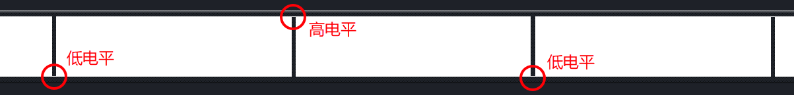
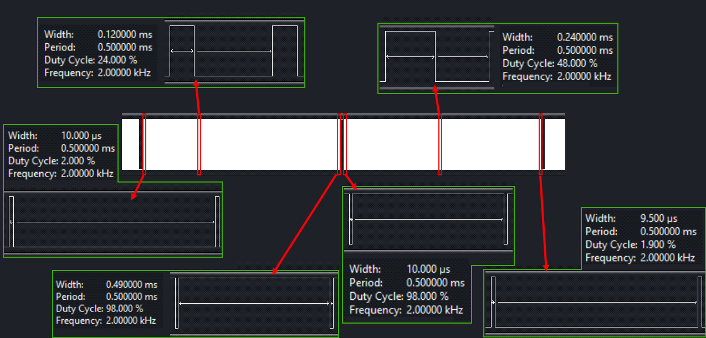

## ESP8266 学习笔记 6 —— PWM 实例
作者：Preston_zhu<br>
日期：2020.6.21

### 1. PWM 实例

参考 RTOS_SDK/examples/peripherals/pwm

#### i. 实现分析

呼吸灯实现的基本方法是：输出固定频率的方波，然后周期性的调整输出方法的占空比，也就是方波一个周期内高电平输出的时间。所以，就是基于 PWM 实例，修改输出 PWM 通道的占空比。

本实例以 GPIO4 作为 PWM 通道 0 输出口，控制 LED 作呼吸灯显示效果。

实现呼吸灯设置参数如下，可以根据自已想要的效果，自行设置：
* PWM 周期 500us
* 每 2s 呼吸一次
* 每 20ms 调整一次占空比

由上两个条件可以得出以下参数：
* 每次呼吸，会改变占空比 100 次
* 每次呼吸，增加占空比 50 次，减少占空比 50 次，形成周期变化
* PWM 周期 500us，占空比从 0% 增加至 100%，每次改变占空比 10us，即占空比变化步长为 10us （详细计算参考下文代码中注释）

#### ii. 主程序分析

```C
/**
 * 说明:
 * 本实例展示如何使用 PWM 实现呼吸灯
 * 使用 GPIO4 作 PWM 输出，控制 LED 显示呼吸灯效果
 *
 * GPIO 配置状态:
 * GPIO4: PWM 通道 0 输出
  *
 * 测试:
 * 连接 GPIO4 至 LED
 * 在 GPIO4 产生不同占空比的固定频率方波，控制 LED 显示
 */
#include <stdio.h>
#include <string.h>
#include <stdlib.h>

#include "freertos/FreeRTOS.h"
#include "freertos/task.h"
#include "freertos/queue.h"

#include "esp_log.h"
#include "esp_system.h"
#include "esp_err.h"

#include "driver/gpio.h"
/* pwm 驱动 */
#include "driver/pwm.h"

#define PWM_CH_NUM          (1)
#define PWM_PERIOD          (500)

/**
 * 呼吸灯占空比步长计算
 * 实例：实现 2 秒/次的呼吸灯效果 
 * 假设每 20 ms 调整一次占空比参数
 * 每次呼吸会改变占空比次数：2000ms / 20ms = 100 次
 * 因此：增加占空比 50 次，减小占空比 50 次
 * PWM 周期为 500 us
 * 占空比变化步长： 500us / 50 = 10us
 * (此时占空比范围：0% ~ 100%)
 * 注意：占空比应该为高电平时长占整个周期时长的百分比，而实际设置的却是高电平工作时长，可能不太好理解。
 */
// #define BREATH_LEN_STEP     (10)
/* 占空比范围：0% ~ 50% */
// #define BREATH_LEN_STEP     (5)
/* 占空比范围：0% ~ 30% */
/* 30% 占空比的呼吸灯效果，个人感觉最好看，步长 10 和 5 都太亮，对比起来暗灯的时间就变短了，效果不明显，还刺眼 */
#define BREATH_LEN_STEP     (3)

// static const char *s_tag = "breath_led";

const uint32_t pwm_chs[PWM_CH_NUM] = { GPIO_NUM_4 };
uint32_t pwm_duties[PWM_CH_NUM] = { 0 };
int16_t pwm_phases[PWM_CH_NUM] = { 0 };

void app_main(void)
{
    int16_t i = 0;

    // 初始化 PWM ，1 个通道，输出至 GPIO4，初始占空比为 0
    pwm_init(PWM_PERIOD, pwm_duties, PWM_CH_NUM, pwm_chs);
    // 设置通道 0 的相位为 0
    pwm_set_phase(0, 0);
    pwm_start();

    for(;;)
    {
        vTaskDelay(20 / portTICK_RATE_MS);

        // 0 到 49，共 50 次，占空比增加
        if(50 > i)
        {
            pwm_duties[0] += BREATH_LEN_STEP;
        }
        // 50 到 99，共 50 次，占空比减少
        else if(100 > i)
        {
            pwm_duties[0] -= BREATH_LEN_STEP;
        }
        // ESP_LOGI(s_tag, "%d -> %d", i, pwm_duties[0]);
        pwm_set_duty(0, pwm_duties[0]);
        // 一定要在此处加 pwm_start()，让设置生效
        pwm_start();
        ++i;

        // 复位，重新开始增加/减少占空比
        if(100 == i)
        {
            i = 0;
        }
    }
}
```

#### iii. 后记

调试了三种效果：
* 占空比变化：0% ~ 100%，亮度比较高，显得从暗变亮时，暗变量的阶段，时间特别短，呼吸效果不太好
* 占空比变化：0% ~ 50%，比上例好一些，但还是显得暗的时间比较短
* 占空比变化：0% ~ 30%，整体效果比较好，所以最后实例选择了这组参数。当然，实例代码中，我只是将前两个调试参数注释了，并未删除。所以读者根据自已需求进行调整即可

#### iv. 图解

从图中可以看出，PWM 波形有作高低电平转换

在各个阶段选择性的展开了一些波形，并测试了一下参数，说明不同时间，PWM 输出波形的占空比变化情况。
如程度内容一致，先增加占空比，再减少占空比，如此反复。

#### v. 遇到的问题记录
1.
一开始上来就写占空比为0，因为是从0开始增加嘛！习惯性的就这样做了。但是由于对代码也不太熟悉，写了之后，灯显示却不对，后来只能返回到 PWM 的实例代码，一步一步调试过来。其实，可以一开始先设定一个固定有输出的效果，然后让基本的内容工作起来，再做进一步改变，会更好！

这里面，其实就有一个，关于思考方式的：正向逻辑与逆向逻辑。正常情况下，如何如何做，为正向。反过来的思考方式，为逆向。

我就是先想着逆向去直接实现，但对于 PWM 代码实现部分，其实并没有我想像的那么熟悉，所以直接做反而出了问题。还是应该正向的，比较保守的来做。

2. 
中间修改占空比参数时，一开始忘记了，一定要在修改 PWM 参数之后，再次调用 pwm_start() 让修改生效。怎么调都发现输出的占空比并未改变，也加重了上一个错误。后来突然想起 API 中有反复提到。

<font color="red">**注意：需要在配置 PWM 后，调用 `pwm_start()` 函数，使设置生效**</font>
