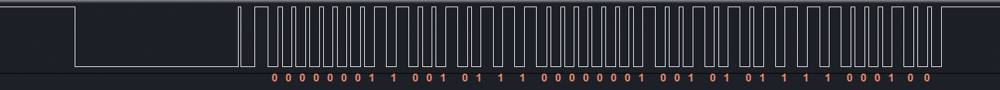

## ESP8266 学习笔记 8 —— AM2301 温湿度传感器实例
作者：Preston_zhu<br>
日期：2020.6.23

### 1. 实例分析

参考 RTOS_SDK/examples/peripherals/gpio
是基于 GPIO 做单线控制

#### i. AM2301 重点内容分析


#### ii. 主程序分析

```C
/**
 * 说明:
 * 本实例展示如何使用 GPIO 控制和读取温湿度传感器 AM 2301
 *
 * GPIO 配置状态:
 * GPIO4: 输出
 *
 * 测试:
 * 连接 GPIO4 至 AM2301 黄线 SDA
 * 控制 GPIO5 发送和接收指定时序的波形，转化为数据，然后处理成温度湿度值
 */

#include <stdio.h>
#include <string.h>
#include <stdlib.h>

/* RTOS_SDK 是基于 FreeRTOS */
#include "freertos/FreeRTOS.h"
#include "freertos/task.h"
#include "freertos/queue.h"

/* GPIO 驱动 */
#include "driver/gpio.h"

/* ESP 日志打印输出 */
#include "esp_log.h"
/* ESP 头文件 */
#include "esp_system.h"

#define AM2301_CTRL_PIN		(GPIO_NUM_4)

static const char *s_tag = "AS2301";

static void gpio_init(void)
{
	gpio_config_t io_conf;
	
	// 设置 GPIO15/16 为输出模式
	// 禁止中断
	io_conf.intr_type = GPIO_INTR_DISABLE;
	// 设置为输出模式
	io_conf.mode = GPIO_MODE_OUTPUT;
	// 位掩码选择 GPIO15/16，置1
	io_conf.pin_bit_mask = GPIO_Pin_4;
	// 禁止下拉
	io_conf.pull_down_en = 0;
	// 禁止上拉
	io_conf.pull_up_en = 0;

	gpio_config(&io_conf);

    gpio_set_level(AM2301_CTRL_PIN, 1);
}

static uint8_t am2301_read_bit(void)
{ 
	int retry = 0;

	// 等待低电平
	while(1 == gpio_get_level(AM2301_CTRL_PIN) && retry < 200)
	{
		++retry;
		os_delay_us(1);
	}
	// 等待高电平
	while(0 == gpio_get_level(AM2301_CTRL_PIN) && retry < 200)
	{
		++retry;
		os_delay_us(1);
	}
	os_delay_us(35);	// 等待 35us

	if(1 == gpio_get_level(AM2301_CTRL_PIN))
	{
		return 1;
	}
	else
	{
		return 0;
	}
}

void app_main(void)
{
	int i = 0;
	int j = 0;
	uint8_t recv_byte[5] = {0};
	int retry = 0;
	int hum = 0;
	int temp = 0;
	uint8_t minus_temp_flag = ' ';

	gpio_init();

	for(;;)
	{
        // 每分钟读取 1 次温湿度
		vTaskDelay(5 * 1000 / portTICK_RATE_MS);
		minus_temp_flag = ' ';
		memset(recv_byte, 0, 5);

		// 发送起始信号
		// 输出拉低 1ms
		gpio_set_level(AM2301_CTRL_PIN, 0);
		os_delay_us(1000);
		// 输出拉高，立刻转为输入模式
		gpio_set_level(AM2301_CTRL_PIN, 1);
		gpio_set_direction(AM2301_CTRL_PIN, GPIO_MODE_INPUT);

		// 监听输入信号，等待 AM2301 应答低电平 80us
		// 此时输入应该为高
		while(1 == gpio_get_level(AM2301_CTRL_PIN) && retry < 1000)
		{
			++retry;
			os_delay_us(1);
		}
		// 如果应答低电平超过 1000us，错误，放弃本次读取
		if(1000 == retry)
		{
			ESP_LOGI(s_tag, "AM2301 ACK Error");
			gpio_set_direction(AM2301_CTRL_PIN, GPIO_MODE_OUTPUT);
			gpio_set_level(AM2301_CTRL_PIN, 1);
			continue;
		}

		// 接收到答低电平 80us，之后还有高电平 80us
		// 监听等其变成高电平
		retry = 0;
		while(0 == gpio_get_level(AM2301_CTRL_PIN) && retry < 1000)
		{
			++retry;
			os_delay_us(1);
		}
		// 如果应答低电平超过 1000us，错误，放弃本次读取
		if(1000 == retry)
		{
			ESP_LOGI(s_tag, "AM2301 ACK Error 2");
			gpio_set_direction(AM2301_CTRL_PIN, GPIO_MODE_OUTPUT);
			gpio_set_level(AM2301_CTRL_PIN, 1);
			continue;
		}

		for(i = 0; i < 5; ++i)
		{
			for(j = 0; j < 8; ++j)
			{
				recv_byte[i] <<= 1;
				recv_byte[i] |= am2301_read_bit();
			}
		}

		// 等待结束信号拉低
		while(0 == gpio_get_level(AM2301_CTRL_PIN));

		gpio_set_direction(AM2301_CTRL_PIN, GPIO_MODE_OUTPUT);
		gpio_set_level(AM2301_CTRL_PIN, 1);

		if(recv_byte[4] != (uint8_t)(recv_byte[0] + recv_byte[1] + recv_byte[2] + recv_byte[3]))
		{
			ESP_LOGI(s_tag, "Receive Data CRC Error");
			continue;
		}

		hum = (recv_byte[0] << 8) | recv_byte[1];
		if(0 != (recv_byte[2] & 0x80))
		{
			minus_temp_flag = '-';
			recv_byte[2] &= 0x7F;
		}
		temp = (recv_byte[2] << 8) | recv_byte[3];
		ESP_LOGI(s_tag, "%d.%d %%RH, %c%d.%d Centigrade", hum / 10, hum % 10,
														  minus_temp_flag,
														  temp / 10, temp % 10);
	}
}

```

#### iii. 打印输出

```shell
I (358) reset_reason: RTC reset 1 wakeup 0 store 0, reason is 1
I (368) gpio: GPIO[4]| InputEn: 0| OutputEn: 1| OpenDrain: 0| Pullup: 0| Pulldown: 0| Intr:0
I (5368) AS2301: 64.2 %RH,  26.8 Centigrade
I (10368) AS2301: 64.2 %RH,  26.9 Centigrade
I (15368) AS2301: 64.3 %RH,  26.8 Centigrade
I (20368) AS2301: 64.3 %RH,  26.9 Centigrade
I (25368) AS2301: 64.3 %RH,  26.8 Centigrade
```

<!-- #### iii. 后记

调试了三种效果：
* 占空比变化：0% ~ 100%，亮度比较高，显得从暗变亮时，暗变量的阶段，时间特别短，呼吸效果不太好
* 占空比变化：0% ~ 50%，比上例好一些，但还是显得暗的时间比较短
* 占空比变化：0% ~ 30%，整体效果比较好，所以最后实例选择了这组参数。当然，实例代码中，我只是将前两个调试参数注释了，并未删除。所以读者根据自已需求进行调整即可 -->

#### iv. 图解

对应的数据位已经注解在图片中

#### v. 遇到的问题记录
1.
怎么样去通过读取波形时序，解析出数据？这个问题其实就是驱动 AM2301 的核心问题。
