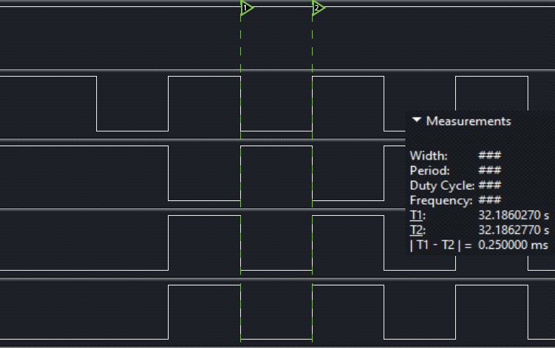

## ESP8266 学习笔记 9 —— IIC
作者：Preston_zhu<br>
日期：2020.6.24

### 0. IIC 硬件描述
ESP8266 有 1 个 IIC 接口，定义如下：
| 管脚名称 | 管脚编号 | IO | 功能名称 |
| ---- | ---- | ---- | ---- |
| MTMS | 9 | IO14 | IIC_SCL |
| GPIO2 | 14 | IO2 | IIC_SDA |
支持 IIC 主机和从机模式
芯片内部提供上拉电阻
IIC 主机的 SDA 与 SCL 波形由 GPIO 模拟产生，在 SCL 的上升沿之后 SDA 取数。SCL 高低电平各保持 5us，所以 IIC 时钟频率约为 100kHz

**IIC 总线协议**
---


* IIC 通信方式为半双工

IIC 硬件连接上仅需要 2 根线，SDA 串行数据线 和 SCL 串行时钟线

IIC 通信原理是通过对 SCL 和 SDA 线高低电平时序进行控制，产生 IIC 总线协议所需要的信号，实现数据的传送

IIC 总线空闲时，需要保持高电平，所以需要上拉电阻保持拉高

IIC 总线上可挂接的设备数量受总线的最大电容 400pF 限制，如果所挂接的是相同型号的器件，则还受器件地址位的限制。

IIC 总线数据传输速率在标准模式下可达 100kbit/s，快速模式下可达 400kbit/s，高速模式下可达 3.4Mbit/s。一般通过IIC总线接口可编程时钟来实现传输速率的调整，同时也跟所接的上拉电阻的阻值有关

IIC 总线上的主设备与从设备之间以字节 (8位) 为单位进行双向的数据传输

* IIC 总线是主从模式

各个从机都有一个惟一的地址，用于主机寻址与通信。地址为 7bit

参考《MYP-6050-Datasheet1.pdf》 6.4 节表中内容

| Item | Pin Config | Address (7 bits) |
| ---- | ---- | ---- |
| IIC Address | AD0 = 0 | 1101000 (0x68) |
| IIC Address | AD1 = 1 | 1101001 (0x69) |
即据芯片 AD0 与 AD1 状态确认 MPU6050 从机地址

* 起始信号与结束信号

IIC 协议规定总线上的数据传输必需以一个起始信号作为开始条件，并以一个结束信号作为停止条件

起始信号与结束信号都有主机产生

起始信号与结束信号如下图示：


起始信号：SCL 保持高电平，SDA 由高电平下拉一段时间

结束信号：SCL 保持高电平，SDA 由低电平上拉成高电平

* 从机应答 ACK 与 NACK


主机按字节 8bit 发送数据，从高位至低信依次发送，在随后的第 9 个时钟位，等待从机应答

从机拉低 SDA，应答 ACK；从机拉高 SDA，应答 NACK

* 数据传输时序


从设备地址 7bit，与 1bit 读写操作位，组成 1字节，首先发送，之后再发送相关的数据

例如本实例中，配置 MPU6050 寄存器时，发送完从设备地址与写操作位之后，发送 MPU6050 寄存器地址，再发送要写入的数值

* IIC 协议写与读时序逻辑


对照参考，理解本实例中 `mpu6050_read()` 和 `mpu6050_write()` 两个函数

### 1. IIC 实例

参考 RTOS_SDK/examples/peripherals/i2c
在原实例上做了修改，方便理解内容
本实例只对 IIC 本身进行讲解，不过多说明 MPU6050 的使用，关于 MPU6050 的内容，之后再另写一个笔记吧

#### i. 流程

* 启动后延时等待 100ms（从设备需要时间启动）
* 初始化 IIC 接口
* 配置 MPU6050 寄存器，使其能正常工作
* 读取 MPU6050 WHO_AM_I 寄存器，验证设备连接与工作是否正常
* 连续读取 MPU6050 加速度、温度、陀螺仪数据寄存器，并输出
* 等待 3s
* 重复读取数据

#### ii. 主程序分析

```C
/**
 * 说明:
 * 本实例展示如何使用 IIC
 * 使用 IIC 控制 MPU6050 六轴传感器
 *
 * GPIO 配置状态:
 * GPIO14 作为主机 SDA 连接至 MPU6050 SDA
 * GPIO2  作为主机 SCL 连接到 MPU6050 SCL
 * 不必要增加外部上拉电阻，驱动程序将使能内部上拉电阻
 *
 * 测试:
 * 如果连接上传感器，则读取数据
 */
#include <stdio.h>
#include <string.h>
#include <stdlib.h>

#include "freertos/FreeRTOS.h"
#include "freertos/task.h"
#include "freertos/queue.h"

#include "esp_log.h"
#include "esp_system.h"
#include "esp_err.h"

#include "driver/i2c.h"
#include "driver/gpio.h"

static const char *TAG = "main";

#define IIC_PORT_2_MPU6050          IIC_NUM_0        /*!< 主机设备 IIC 端口号 */

#define MPU6050_SENSOR_ADDR         0x68             /*!< 从机 MPU6050 地址 */
#define MPU6050_CMD_START           0x41             /*!< 设置 MPU6050 测量模式指令 */
#define MPU6050_WHO_AM_I            0x75             /*!< 读取 MPU6050 WHO_AM_I 寄存器指令 */
#define WRITE_BIT                   IIC_MASTER_WRITE /*!< IIC 主机写操作位 */
#define READ_BIT                    IIC_MASTER_READ  /*!< IIC 主机读操作位 */
#define ACK_CHECK_EN                0x1              /*!< IIC 主机确认接收从机 ACK 信号 */
#define ACK_CHECK_DIS               0x0              /*!< IIC 主机不接收从机 ACK 信号  */
#define ACK_VAL                     0x0              /*!< IIC ACK值 */
#define NACK_VAL                    0x1              /*!< IIC NACK值 */
#define LAST_NACK_VAL               0x2              /*!< IIC 末尾ACK值 */

/**
 * MPU6050 寄存器地址
 */
#define SMPLRT_DIV                  0x19
#define CONFIG                      0x1A
#define GYRO_CONFIG                 0x1B
#define ACCEL_CONFIG                0x1C
#define ACCEL_XOUT_H                0x3B
#define ACCEL_XOUT_L                0x3C
#define ACCEL_YOUT_H                0x3D
#define ACCEL_YOUT_L                0x3E
#define ACCEL_ZOUT_H                0x3F
#define ACCEL_ZOUT_L                0x40
#define TEMP_OUT_H                  0x41
#define TEMP_OUT_L                  0x42
#define GYRO_XOUT_H                 0x43
#define GYRO_XOUT_L                 0x44
#define GYRO_YOUT_H                 0x45
#define GYRO_YOUT_L                 0x46
#define GYRO_ZOUT_H                 0x47
#define GYRO_ZOUT_L                 0x48
#define SIG_PATH_RST                0x68
#define PWR_MGMT_1                  0x6B
#define WHO_AM_I                    0x75

/* IIC 主机初始化：主机模式，GPIO */
static esp_err_t i2c_module_init(void)
{
	i2c_config_t conf;

	// 主机模式
	conf.mode = IIC_MODE_MASTER;
	// GPIO14 -> SDA
	conf.sda_io_num = GPIO_NUM_14;
	// SDA 引脚上拉
	conf.sda_pullup_en = 0;
	// GPIO2 -> SCL
	conf.scl_io_num = GPIO_NUM_2;
	// SCL 引脚上拉
	conf.scl_pullup_en = 0;

	// 设置 IIC 工作模式
	ESP_ERROR_CHECK(i2c_driver_install(IIC_PORT_2_MPU6050, conf.mode));
	// 设置 IIC 引脚配置
	ESP_ERROR_CHECK(i2c_param_config(IIC_PORT_2_MPU6050, &conf));

	return ESP_OK;
}

/* IIC 主机发送数据 */
static esp_err_t mpu6050_write(i2c_port_t i2c_num, uint8_t reg_address,
							   uint8_t *data, size_t data_len)
{
	int ret = 0;
	// 创建 IIC 命令连接
	i2c_cmd_handle_t cmd = i2c_cmd_link_create();

	// 创建一个命令队列，并装载一个起始信号
	i2c_master_start(cmd);
	// 装载一个从机地址及写指令，ACK 应答使能
	i2c_master_write_byte(cmd, MPU6050_SENSOR_ADDR << 1 | WRITE_BIT, ACK_CHECK_EN);
	// 装载从机寄存器地址，ACK应答使能
	i2c_master_write_byte(cmd, reg_address, ACK_CHECK_EN);
	// 装载写至从机寄存器的数据，ACK应答使能
	i2c_master_write(cmd, data, data_len, ACK_CHECK_EN);
	// 装载停止信号
	i2c_master_stop(cmd);

	// 发送命令队列中的数据
	ret = i2c_master_cmd_begin(i2c_num, cmd, 1000 / portTICK_RATE_MS);
	// 释放命令连接
	i2c_cmd_link_delete(cmd);

	return ret;
}

/**
 * 1. IIC 主机发送待读取寄存器地址到从设备
 * 2. IIC 主机读取从机返回的数据
 */
static esp_err_t mpu6050_read(i2c_port_t i2c_num, uint8_t reg_address,
							  uint8_t *data, size_t data_len)
{
	int ret;
	// 创建 IIC 命令连接
	i2c_cmd_handle_t cmd = i2c_cmd_link_create();

	// 给从机发送读数据地址，通知其准备数据
	// 创建一个命令队列，并装载一个起始信号
	i2c_master_start(cmd);
	// 装载一个从机地址及写指令，ACK 应答使能
	i2c_master_write_byte(cmd, MPU6050_SENSOR_ADDR << 1 | WRITE_BIT, ACK_CHECK_EN);
	// 装载从机寄存器地址，即待读取数据的寄存器地址，ACK应答使能
	i2c_master_write_byte(cmd, reg_address, ACK_CHECK_EN);
	// 装载停止信号
	i2c_master_stop(cmd);
	// 发送命令队列中的数据
	ret = i2c_master_cmd_begin(i2c_num, cmd, 1000 / portTICK_RATE_MS);
	// 释放命令连接
	i2c_cmd_link_delete(cmd);

	// 验证读取命令是否发送成功
	if(ret != ESP_OK)
	{
		return ret;
	}

	// 主机读取从机发送的数据
	cmd = i2c_cmd_link_create();
	// 创建一个命令队列，并装载一个起始信号
	i2c_master_start(cmd);
	// 装载一个从机地址及读指令，ACK 应答使能
	i2c_master_write_byte(cmd, MPU6050_SENSOR_ADDR << 1 | READ_BIT, ACK_CHECK_EN);
	// 装载读取命令，待读取数据缓存区和数据长度，用于从 IIC 总线读取数据，
	// 最后一个数据应答 NACK
	i2c_master_read(cmd, data, data_len, LAST_NACK_VAL);
	// 装载停止信号
	i2c_master_stop(cmd);
	// 发送命令队列中的数据
	// ** 这里不好理解 **
	// 命令队列中装载了读取的信息：缓存区和数据长度，
	// 这里才会真正处理读取数据操作。是阻塞运行。并将读取的数据存储至缓存区
	// 所以程序返回时，数据应该已经读取到缓存区了，可以再取出来用了
	// 多个数据的读取，被封装在底层驱动中了
	ret = i2c_master_cmd_begin(i2c_num, cmd, 1000 / portTICK_RATE_MS);
	// 释放命令连接
	i2c_cmd_link_delete(cmd);

	return ret;
}

/* 初始化 MPU6050 */
static esp_err_t mpu6050_init(i2c_port_t i2c_num)
{
	uint8_t cmd_data;

	vTaskDelay(100 / portTICK_RATE_MS);

	i2c_module_init();	// 初始化 IIC 接口

	// 对 MPU6050 进行必要的配置
	cmd_data = 0x00;	// 设置 PWR_MGMT_1 寄存器，唤醒 MPU6050
	ESP_ERROR_CHECK(mpu6050_write(i2c_num, PWR_MGMT_1, &cmd_data, 1));
	cmd_data = 0x07;    // 设置 SMPRT_DIV 寄存器, 设置陀螺仪输出速率分频：8 分频
	ESP_ERROR_CHECK(mpu6050_write(i2c_num, SMPLRT_DIV, &cmd_data, 1));
	cmd_data = 0x06;    // 设置 CONFIG 寄存器，设置数字低通过滤器 (DLPF) 
	ESP_ERROR_CHECK(mpu6050_write(i2c_num, CONFIG, &cmd_data, 1));
	cmd_data = 0x18;    // 设置 GYRO_CONFIG 寄存器，设置陀螺仪测量范围: +/- 1000dps
	ESP_ERROR_CHECK(mpu6050_write(i2c_num, GYRO_CONFIG, &cmd_data, 1));
	cmd_data = 0x01;    // 设置 ACCEL_CONFIG 寄存器，设置加速计测量范围：+/-2g
	ESP_ERROR_CHECK(mpu6050_write(i2c_num, ACCEL_CONFIG, &cmd_data, 1));

	return ESP_OK;
}

static void i2c_task_example(void *arg)
{
	uint8_t sensor_data[14];
	uint8_t who_am_i = 0;
	double temp = 0;
	static uint32_t error_count = 0;
	int ret = 0;

	// 初始化 MPU6050
	mpu6050_init(IIC_PORT_2_MPU6050);

	while(1)
	{
		who_am_i = 0;
		// 读取 WHO_AM_I 寄存器，验证 MPU6050 连接与数据读取
		mpu6050_read(IIC_PORT_2_MPU6050, WHO_AM_I, &who_am_i, 1);
		if(0x68 != who_am_i)
		{
			error_count++;
		}

		temp = 0;
		memset(sensor_data, 0, 14);
		// 读取 MPU6050 加速计、温度传感器与陀螺仪数据
		ret = mpu6050_read(IIC_PORT_2_MPU6050, ACCEL_XOUT_H, sensor_data, 14);

		if(ret == ESP_OK)
		{
			ESP_LOGI(TAG, "*******************");
			ESP_LOGI(TAG, "WHO_AM_I: 0x%02x", who_am_i);
			temp = 36.53 + ((double)(int16_t)((sensor_data[6] << 8) | sensor_data[7]) / 340);
			ESP_LOGI(TAG, "TEMP: %d.%d", (uint16_t)temp, (uint16_t)(temp * 100) % 100);

			ESP_LOGI(TAG, "Accel X: %d", (int16_t)((sensor_data[0] << 8) | sensor_data[1]));
			ESP_LOGI(TAG, "Accel Y: %d", (int16_t)((sensor_data[2] << 8) | sensor_data[3]));
			ESP_LOGI(TAG, "Accel Z: %d", (int16_t)((sensor_data[4] << 8) | sensor_data[5]));

			ESP_LOGI(TAG, "Gyros X: %d", (int16_t)((sensor_data[8] << 8) | sensor_data[9]));
			ESP_LOGI(TAG, "Gyros Y: %d", (int16_t)((sensor_data[10] << 8) | sensor_data[11]));
			ESP_LOGI(TAG, "Gyros Z: %d", (int16_t)((sensor_data[12] << 8) | sensor_data[13]));

			ESP_LOGI(TAG, "error_count: %d\n", error_count);
		}
		else
		{
			ESP_LOGE(TAG, "No ack, sensor not connected...skip...\n");
		}

		vTaskDelay(3000 / portTICK_RATE_MS);
	}

	i2c_driver_delete(IIC_PORT_2_MPU6050);
}

void app_main(void)
{
	xTaskCreate(i2c_task_example, "i2c_task_example", 2048, NULL, 10, NULL);
}
```

#### iii. 打印输出

```shell
I (383) reset_reason: RTC reset 1 wakeup 0 store 0, reason is 1
I (483) gpio: GPIO[14]| InputEn: 0| OutputEn: 1| OpenDrain: 1| Pullup: 0| Pulldown: 0| Intr:0
I (483) gpio: GPIO[2]| InputEn: 0| OutputEn: 1| OpenDrain: 1| Pullup: 0| Pulldown: 0| Intr:0
I (503) main: *******************
I (503) main: WHO_AM_I: 0x68
I (503) main: TEMP: 28.41
I (513) main: Accel X: 7938
I (513) main: Accel Y: 14390
I (523) main: Accel Z: -310
I (523) main: Gyros X: -45
I (533) main: Gyros Y: -20
I (533) main: Gyros Z: -10
I (543) main: error_count: 0

I (3553) main: *******************
I (3553) main: WHO_AM_I: 0x68
I (3553) main: TEMP: 28.41
I (3553) main: Accel X: 7938
I (3563) main: Accel Y: 14390
I (3563) main: Accel Z: -310
I (3573) main: Gyros X: -45
I (3573) main: Gyros Y: -20
I (3583) main: Gyros Z: -10
I (3583) main: error_count: 0
```

#### iv. IIC 应用代码流程


##### vi. 理解
IIC 驱动将每次读写操作，都封装成一个指令队列。用户需要按照 IIC 协议的时序规定，将对应的内容按要求装载到队列中，然后操作 IIC 接口发送数据与接收数据

不好理解的地方是接收数据。因为代码流程是一步步装载数据到队列，怎么就读取到数据了呢？与 IIC 协议表达的内容有些不一样啊？
根据 API 的说明，调用函数 `i2c_master_cmd_begin()` 发送数据，此函数操作会阻塞。写数据的时候，仅发送内容。读数据的时候，先发送对应地址，然后读取从机返回内容。这些操作，都封装在 IIC 驱动底层了。对上层应用理解，仅需要理解这里只是将读取数据后的缓存区和读取数据长度传进队列即可，之后由 IIC 驱动操作。正确返回后，再去缓存区取数据即可。

### 3. API

#### i.头文件：`esp266/include/driver/i2c.h`

#### ii.函数概览：

```C
esp_err_t i2c_driver_install(i2c_port_t i2c_num, i2c_mode_t mode);
esp_err_t i2c_driver_delete(i2c_port_t i2c_num);
esp_err_t i2c_param_config(i2c_port_t i2c_num, const i2c_config_t *i2c_conf);
esp_err_t i2c_set_pin(i2c_port_t i2c_num,
					  int sda_io_num,
					  int scl_io_num,
					  gpio_pullup_t sda_pullup_en,
					  gpio_pullup_t scl_pullup_en,
					  i2c_mode_t mode);
i2c_cmd_handle_t i2c_cmd_link_create(void);
void i2c_cmd_link_delete(i2c_cmd_handle_t cmd_handle);
esp_err_t i2c_master_start(i2c_cmd_handle_t cmd_handle)
esp_err_t i2c_master_write_byte(i2c_cmd_handle_t cmd_handle,
							    uint8_t data,
								bool ack_en)
esp_err_t i2c_master_write(i2c_cmd_handle_t cmd_handle,
						   uint8_t *data,
						   size_t data_len,
						   bool ack_en)
esp_err_t i2c_master_read_byte(i2c_cmd_handle_t cmd_handle,
							   uint8_t *data,
							   i2c_ack_type_t ack)
esp_err_t i2c_master_read(i2c_cmd_handle_t cmd_handle,
						  uint8_t *data,
						  size_t data_len,
						  i2c_ack_type_t ack)
esp_err_t i2c_master_stop(i2c_cmd_handle_t cmd_handle)
esp_err_t i2c_master_cmd_begin(i2c_port_t i2c_num,
							   i2c_cmd_handle_t cmd_handle,
							   TickType_t ticks_to_wait)
```

#### iii.函数说明：

```C
esp_err_t i2c_driver_install(i2c_port_t i2c_num, i2c_mode_t mode)
```
IIC 驱动服务安装

返回值：

* `ESP_OK` - 成功
* `ESP_ERR_INVALID_ARG` - 参数错误
* `ESP_FAIL` - 驱动服务安装失败

参数：

* `i2c_num` - IIC 接口号
* `mode` -  IIC 模式（主机模式或从机模式）

```C
esp_err_t i2c_driver_delete(i2c_port_t i2c_num)
```
IIC driver delete.

返回值：

* `ESP_OK` - 成功
* `ESP_ERR_INVALID_ARG` - 参数错误

参数：

* i2c_num: IIC port number

```C
esp_err_t i2c_param_config(i2c_port_t i2c_num, const i2c_config_t *i2c_conf )
```
IIC 参数初始化
注意：必需在调用 `i2c_driver_install()` 安装驱动服务之后使用

返回值：

* `ESP_OK` - 成功
* `ESP_ERR_INVALID_ARG` - 参数错误

参数：

* `i2c_num` - IIC 接口号
* `i2c_conf` - 指针，IIC 设置参数结构体

```C
esp_err_t i2c_set_pin(i2c_port_t i2c_num, int sda_io_num, int scl_io_num, gpio_pullup_t sda_pullup_en, gpio_pullup_t scl_pullup_en, i2c_mode_t mode)
```
Configure GPIO signal for IIC sck and sda.

返回值：

* `ESP_OK` - 成功
* `ESP_ERR_INVALID_ARG` - 参数错误

参数：

* i2c_num: IIC port number
* sda_io_num: GPIO number for IIC sda signal
* scl_io_num: GPIO number for IIC scl signal
* sda_pullup_en: Whether to enable the internal pullup for sda pin
* scl_pullup_en: Whether to enable the internal pullup for scl pin
* mode: IIC mode

```C
i2c_cmd_handle_t i2c_cmd_link_create(void)
```
创建和初始化 IIC 命令连接
注意：
在建立 IIC 命令连接着，需要先调用 `i2c_cmd_link_create()` 创建命令连接。
在发送完成命令之后，需要调用 `i2c_cmd_link_delete() 释放命令连接，释放资源

返回：

* `i2c_cmd_handle_t` - IIC 命令连接句柄

```C
void i2c_cmd_link_delete(i2c_cmd_handle_t cmd_handle)
```
释放 IIC 命令连接
注意：
在建立 IIC 命令连接着，需要先调用 `i2c_cmd_link_create()` 创建命令连接。
在发送完成命令之后，需要调用 `i2c_cmd_link_delete() 释放命令连接，释放资源

参数：

* `cmd_handle` - IIC 命令连接句柄

```C
esp_err_t i2c_master_start(i2c_cmd_handle_t cmd_handle)
```
开始一个 IIC 主机的命令队列，并装载一个 IIC 起始信号
注意：仅能在主机模式下调用此函数。之后调用 `i2c_master_cmd_begin()` 函数发送整个命令队列内容

返回值：

* `ESP_OK` - 成功
* `ESP_ERR_INVALID_ARG` - 参数错误

参数：

* `cmd_handle` - IIC 命令连接句柄

```C
esp_err_t i2c_master_write_byte(i2c_cmd_handle_t cmd_handle, uint8_t data, bool ack_en)
```
装载 1 个待发送到 IIC 总线的数据，到 IIC 主机的命令队列
注意：仅能在主机模式下调用此函数。之后调用 `i2c_master_cmd_begin()` 函数发送整个命令队列内容

返回值：

* `ESP_OK` - 成功
* `ESP_ERR_INVALID_ARG` - 参数错误

参数：

* `cmd_handle` - IIC 命令连接句柄
* `data` - 发送至 IIC 总线的单字节命令
* `ack_en` - 是否使能主机处理从机 ACK 应答

```C
esp_err_t i2c_master_write(i2c_cmd_handle_t cmd_handle, uint8_t *data, size_t data_len, bool ack_en)
```
装载待发送到 IIC 总线的数据，到 IIC 主机的命令队列
注意：仅能在主机模式下调用此函数。之后调用 `i2c_master_cmd_begin()` 函数发送整个命令队列内容

返回值：

* `ESP_OK` - 成功
* `ESP_ERR_INVALID_ARG` - 参数错误

参数：

* `cmd_handle` - IIC 命令连接句柄
* `data` - 发送数据
* `data_len` - 数据长度
* `ack_en` - 是否使能主机处理从机 ACK 应答

```C
esp_err_t i2c_master_read_byte(i2c_cmd_handle_t cmd_handle, uint8_t *data, i2c_ack_type_t ack)
```
Queue command for IIC master to read one byte from IIC bus.
Note Only call this function in IIC master mode Call i2c_master_cmd_begin() to send all queued commands

返回值：

* `ESP_OK` - 成功
* `ESP_ERR_INVALID_ARG` - 参数错误

参数：

* `cmd_handle` - IIC 命令连接句柄
* data: pointer accept the data byte
* ack: ack value for read command

```C
esp_err_t i2c_master_read(i2c_cmd_handle_t cmd_handle,
						  uint8_t *data,
						  size_t data_len,
						  i2c_ack_type_t ack)
```
IIC 主机的命令队列，从 IIC 总线读取数据
注意：仅能在主机模式下调用此函数。之后调用 `i2c_master_cmd_begin()` 函数发送整个命令队列内容

返回值：

* `ESP_OK` - 成功
* `ESP_ERR_INVALID_ARG` - 参数错误

参数：

* `cmd_handle` - IIC 命令连接句柄
* `data` - 数据缓冲区，用于存储从 IIC 总线接收到的数据
* `data_len` - 接收数据长度
* `ack` - 读取命令的 ACK 值

```C
esp_err_t i2c_master_stop(i2c_cmd_handle_t cmd_handle)
```
装载一个停止信号到 IIC 主机的命令队列
注意：仅能在主机模式下调用此函数。之后调用 `i2c_master_cmd_begin()` 函数发送整个命令队列内容

返回值：

* `ESP_OK` - 成功
* `ESP_ERR_INVALID_ARG` - 参数错误

参数：

* `cmd_handle` - IIC 命令连接句柄

```C
esp_err_t i2c_master_cmd_begin(i2c_port_t i2c_num,
							   i2c_cmd_handle_t cmd_handle,
							   TickType_t ticks_to_wait)
```
IIC 主机发送命令队列。此函数将触发发送所有已经装载至队列的命令。发送时任务将会阻塞，直至所有的命令数据都被发送完成
IIC API 都是非线程安全类函数，如果需要在不同的任务中使用同一个 IIC 接口，需要注意多线程访问问题
注意：仅能在主机模式下调用此函数

返回值：

* `ESP_OK` - 成功
* `ESP_ERR_INVALID_ARG` - 参数错误
* `ESP_FAIL` - 设置命令错误，从机未应答
* `ESP_ERR_INVALID_STATE` - IIC 驱动服务未安装或者当前非主机模式
* `ESP_ERR_TIMEOUT` - 总线忙，操作超时

参数：

* `i2c_num` - IIC 接口号
* `cmd_handle` - IIC 命令连接句柄
* `ticks_to_wait` - 最大等待节拍数

---

结构体
```C
struct i2c_config_t
	IIC initialization parameters.
	Public Members
	i2c_mode_t mode
	IIC mode
	gpio_num_t sda_io_num
	GPIO number for IIC sda signal
	gpio_pullup_t sda_pullup_en
	Internal GPIO pull mode for IIC sda signal
	gpio_num_t scl_io_num
	GPIO number for IIC scl signal
	gpio_pullup_t scl_pullup_en
	Internal GPIO pull mode for IIC scl signal
	uint32_t clk_stretch_tick
	Clock Stretch time, depending on CPU frequency
```

类型定义
```C
typedef void *i2c_cmd_handle_t
// IIC 指令句柄
```

枚举
```C
enum i2c_mode_t
	IIC_MODE_MASTER				// IIC 主机模式
	IIC_MODE_MAX
```

```C
enum i2c_rw_t
	IIC_MASTER_WRITE = 0		// IIC 写数据
	IIC_MASTER_READ				// IIC 读数据
```

```C
enum i2c_opmode_t
	IIC_CMD_RESTART = 0			// IIC 重新起始指令
	IIC_CMD_WRITE				// IIC 写指令
	IIC_CMD_READ				// IIC 读指令
	IIC_CMD_STOP				// IIC 停止指令
```

```C
enum i2c_port_t
	IIC_NUM_0 = 0           	// IIC 端口 0
	IIC_NUM_MAX
```

```C
enum i2c_ack_type_t
	IIC_MASTER_ACK = 0x0		// IIC 读取每字节数据都应答 ACK
	IIC_MASTER_NACK = 0x1		// IIC 读取每字节数据不应答 NACK
	IIC_MASTER_LAST_NACK = 0x2	// IIC 读取末尾字节数据不应答 NACK
	IIC_MASTER_ACK_MAX
```

### 4. 相位计算

周期T：period，单位：s

频率f：frequency = 1 / 周期

相位：Phase = 2&pound;f

相位范围应当为：(-180, 180)

相位差：针对同频率波形而言

简单的理解，就是两个波形（周期性）相对应部分的时间差，例如起始位置的时间差

实例中，设置了相位差分别为：0，0，50，-50，则对应计算 4 个通道输出波形时间差为：
* 通道 0：时间差 = 0s
* 通道 1：时间差 = 0s
* 通道 2：时间差 = 50 / 180 x 500us = 138us
* 通道 3：时间差 = 250us - 50 / 180 x 500us = 112us

这里有个疑问：

相位计算取的半个周期： 50 度 / 180 度，然后使用了一个周期的时间 500us，计算的值与实际的值一致。为什么不是用半个周期的时间 250us 呢？
猜想：应该是因为此方波没有负半轴的波形，相位只有 180 度

### 5. 其它实例测试
#### i. 特殊相位差实例

相位参数为 (0, 0, 90, -90) 

从图可知：
通道 2 波形与通道 3 和 4 均差半个波形，因为相位相差 90 度
通道 3 与 4 则波形相同，因为相位相关 180 度

#### ii. 不同占空比实例

占空比参数为 (100, 200, 300, 400)


#### iii. 下图为实例输出五个通道

具体参数为：
* GPIO：12/13/14/15/16  
* 占空比：(250, 250, 250, 250, 250)
* 相位：(0, 0, 0, 0, 0)

成功验证了多于 4 个 PWM 通道输出


